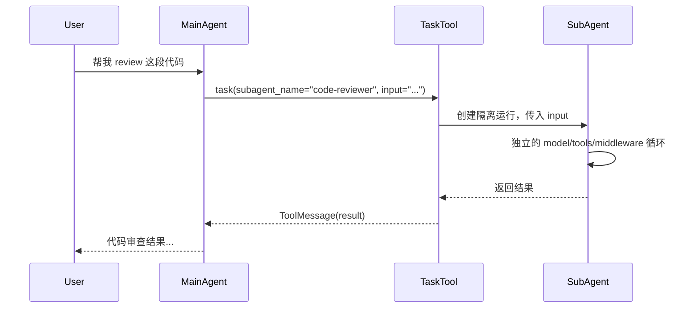

# Deep Agents 源码解读：在 create_agent 之上构建生产级 Agent

## 一、Deep Agents 是什么

Deep Agents（`deepagents` 包，v0.7.1）是 LangChain 官方的 Agent 增强层。
它不是独立框架，而是**在 `create_agent` 之上组装了一整套 middleware 栈**，
提供文件操作、子 Agent 编排、Skills、Memory、沙箱执行、会话压缩等生产级能力。

核心入口只有一个：

```python
from deepagents import create_deep_agent

agent = create_deep_agent(
    model="openai:gpt-5.5",
    tools=[...],           # 额外工具（内置工具自动加载）
    subagents=[...],       # 子 Agent 定义
    skills=["/skills/"],   # 技能目录
    memory=["/AGENTS.md"], # 记忆文件
    permissions=[...],     # 权限规则
    backend=...,           # 存储/执行后端
)
```

它的本质就是：

```
create_deep_agent(...)
  └→ create_agent(
       model=...,
       tools=[内置tools + 用户tools],
       middleware=[组装好的middleware栈],
       ...
     )
```

---

## 二、架构总览

### 2.1 Graph 结构

`create_deep_agent` 最终调用 `create_agent` 编译出的图结构跟普通 agent 一样
（model → tools → model → ...），但 middleware 节点多得多：

```mermaid
flowchart TD
    START([START])
    END_NODE([END])

    %% ================================================================
    %%  before_agent 区域 — 每个 middleware 一个节点
    %% ================================================================
    START --> SKILL_BA{{"SkillsMiddleware\n.before_agent"}}
    SKILL_BA --> FS_BA{{"FilesystemMiddleware\n.before_agent"}}
    FS_BA --> SA_BA{{"SubAgentMiddleware\n.before_agent"}}
    SA_BA --> SUM_BA{{"SummarizationMiddleware\n.before_agent"}}
    SUM_BA --> PATCH_BA{{"PatchToolCalls\n.before_agent"}}

    %% ================================================================
    %%  agent loop
    %% ================================================================

    %% ---- before_model ----
    PATCH_BA --> SKILL_BM{{"SkillsMiddleware\n.before_model"}}
    SKILL_BM --> FS_BM{{"FilesystemMiddleware\n.before_model"}}
    FS_BM --> SA_BM{{"SubAgentMiddleware\n.before_model"}}
    SA_BM --> SUM_BM{{"SummarizationMiddleware\n.before_model"}}

    %% ---- model ----
    SUM_BM --> MODEL[/"model\n调用 LLM"/]

    %% ---- after_model（反序） ----
    MODEL --> SUM_AM{{"SummarizationMiddleware\n.after_model"}}
    SUM_AM --> SA_AM{{"SubAgentMiddleware\n.after_model"}}
    SA_AM --> FS_AM{{"FilesystemMiddleware\n.after_model"}}
    FS_AM --> SKILL_AM{{"SkillsMiddleware\n.after_model"}}

    %% ---- 条件边 ----
    SKILL_AM --> ROUTE_M{"model_to_tools\n路由"}

    ROUTE_M -->|"有 pending\ntool_calls"| TOOLS
    ROUTE_M -->|"无 tool_calls"| SA_AA

    %% ---- tools ----
    TOOLS[/"tools\n并行执行"/]

    TOOLS --> ROUTE_T{"tools_to_model\n路由"}
    ROUTE_T -->|"默认"| SKILL_BM
    ROUTE_T -->|"退出循环"| SA_AA

    %% ================================================================
    %%  after_agent 区域（反序）
    %% ================================================================
    SA_AA{{"SubAgentMiddleware\n.after_agent"}}
    SA_AA --> FS_AA{{"FilesystemMiddleware\n.after_agent"}}
    FS_AA --> SKILL_AA{{"SkillsMiddleware\n.after_agent"}}
    SKILL_AA --> END_NODE

    %% ================================================================
    %%  样式
    %% ================================================================
    classDef coreNode fill:#e94560,stroke:#fff,stroke-width:4px,color:#fff
    classDef hookNode fill:#0f3460,stroke:#3282b8,stroke-width:2px,color:#bbe1fa
    classDef routeNode fill:#533483,stroke:#bb86fc,stroke-width:2px,color:#e0e0e0

    class MODEL,TOOLS coreNode
    class SKILL_BA,FS_BA,SA_BA,SUM_BA,PATCH_BA hookNode
    class SKILL_BM,FS_BM,SA_BM,SUM_BM hookNode
    class SUM_AM,SA_AM,FS_AM,SKILL_AM hookNode
    class SA_AA,FS_AA,SKILL_AA hookNode
    class ROUTE_M,ROUTE_T routeNode
```



> 注：上图只画了核心 middleware（Skills、Filesystem、SubAgent、Summarization、PatchToolCalls）。
> 实际还有 AsyncSubAgent、PromptCaching、Memory、HumanInTheLoop 等 tail middleware，
> 它们的 hook 节点按相同模式串联在尾部。

### 2.2 Middleware 栈组装顺序

```
┌─ Base Stack ──────────────────────────────────────────────┐
│  SkillsMiddleware        ← skills 参数（可选）              │
│  FilesystemMiddleware    ← 内置，必须                      │
│  SubAgentMiddleware      ← 内置，必须                      │
│  SummarizationMiddleware ← 自动会话压缩                    │
│  PatchToolCallsMiddleware← 修复悬挂 tool_calls             │
│  AsyncSubAgentMiddleware ← 异步子 Agent（可选）             │
├─ User Middleware ─────────────────────────────────────────┤
│  [用户自定义 middleware]                                    │
├─ Tail Stack ──────────────────────────────────────────────┤
│  Profile extra_middleware                                  │
│  _ToolExclusionMiddleware ← 排除指定工具                    │
│  AnthropicPromptCachingMiddleware                          │
│  BedrockPromptCachingMiddleware                            │
│  FireworksPromptCachingMiddleware                          │
│  MemoryMiddleware          ← memory 参数（可选）            │
│  HumanInTheLoopMiddleware  ← interrupt_on 参数（可选）      │
└──────────────────────────────────────────────────────────┘
```

---

## 三、内置工具

`create_deep_agent` 自动注册的工具（无需手动传入）：

| 工具 | 来源 | 功能 |
|------|------|------|
| `ls` | FilesystemMiddleware | 列目录 |
| `read_file` | FilesystemMiddleware | 读文件（支持图片/视频/PDF 多模态） |
| `write_file` | FilesystemMiddleware | 写文件 |
| `edit_file` | FilesystemMiddleware | 编辑文件（行级替换） |
| `delete` | FilesystemMiddleware | 删除文件 |
| `glob` | FilesystemMiddleware | 文件名匹配 |
| `grep` | FilesystemMiddleware | 内容搜索（ripgrep 后端） |
| `execute` | FilesystemMiddleware | 执行 shell 命令（需 SandboxBackend） |
| `task` | SubAgentMiddleware | 调用子 Agent |

用户传入的 `tools` 是**追加**的，不会替换内置工具。

---

## 四、Backend 体系：存储与执行

Deep Agents 用 `BackendProtocol` 抽象了文件操作，用 `SandboxBackendProtocol` 扩展了执行能力。

### 4.1 协议层次

```
BackendProtocol（纯文件操作）
  ├─ ls, read, write, edit, delete, grep, glob
  └─ upload_files, download_files

SandboxBackendProtocol(BackendProtocol)（文件 + 执行）
  └─ execute(command, timeout) → str
```

### 4.2 内置 Backend 实现

| Backend | 存储位置 | 能执行命令？ | 用途 |
|---------|---------|------------|------|
| `StateBackend` | 内存（LangGraph state） | ❌ | 默认，临时文件 |
| `FilesystemBackend` | 本地磁盘 | ❌ | 持久化文件操作 |
| `LocalShellBackend` | 本地磁盘 | ✅（无沙箱） | 本地开发 |
| `BaseSandbox` | 抽象 | ✅（沙箱化） | 安全执行基类 |
| `LangSmithSandbox` | LangSmith 云 | ✅（沙箱化） | 云端安全执行 |
| `CompositeBackend` | 按路径分发 | 取决于默认 backend | 混合存储 |
| `StoreBackend` | LangGraph Store | ❌ | 跨 thread 持久化 |
| `ContextHubBackend` | LangSmith Hub | ❌ | 云端持久化 |

### 4.3 BaseSandbox 的巧妙设计

`BaseSandbox` 是抽象基类，子类只需实现 `execute()`、`upload_files()`、`download_files()`。
它把所有文件操作（read/write/edit/grep/glob）都转换成 `execute()` 调用：

```python
# BaseSandbox.read() 的实现思路
def read(self, path):
    return self.execute(f"cat {path}")  # 委托给沙箱的 execute

# BaseSandbox.edit() 的实现思路
def edit(self, path, old, new):
    # 小改动：直接 execute sed
    # 大改动：upload 临时文件 + execute mv
```

这意味着：**只要实现了 `execute()`，就自动获得全部文件操作能力**。

---

## 五、Middleware 详解

### 5.1 FilesystemMiddleware — 文件操作 + 执行

核心 middleware，提供 9 个内置工具。关键能力：

- **多模态读取**：图片返回 content block，视频自动抽帧，音频返回 audio block
- **大结果驱逐**：超过 token 阈值的 tool 结果自动写入文件，返回摘要 + 路径
- **权限执行**：根据 `FilesystemPermission` 规则 allow/deny/interrupt
- **分页**：`ls` 和 `grep` 支持 offset/limit

### 5.2 SubAgent 体系：三种子 Agent

Deep Agents 提供 **3 种子 Agent 类型**，对应不同的执行模式：

| 类型 | 类 | 执行模式 | 通过什么工具调用 |
|------|------|---------|---------------|
| **SubAgent** | `SubAgent` | 同步、声明式 | `task` 工具 |
| **CompiledSubAgent** | `CompiledSubAgent` | 同步、预编译 | `task` 工具 |
| **AsyncSubAgent** | `AsyncSubAgent` | 异步、远程/后台 | 5 个 async 工具 |

#### SubAgent — 声明式同步子 Agent

最常见的类型。声明 name、description、system_prompt，框架自动编译：

```python
subagents = [
    SubAgent(
        name="code-reviewer",
        description="Review code for bugs and style issues",
        system_prompt="You are a code reviewer...",
        tools=[...],            # 可选：覆盖父 Agent 工具
        model="openai:gpt-5.5", # 可选：使用不同模型
        middleware=[...],        # 可选：额外 middleware
        permissions=[...],       # 可选：独立权限规则
        skills=["/skills/"],     # 可选：独立技能
        response_format=...,     # 可选：结构化输出
    ),
]
```

子 Agent 是**完全隔离的 agent 运行**：独立的 model、tools、middleware、system prompt。
通过 `task` 工具的 `subagent_name` 参数选择要调用的子 Agent。

#### CompiledSubAgent — 预编译同步子 Agent

适用于需要完全控制图结构的场景。传入一个已编译的 `Runnable`：

```python
from langgraph.graph import StateGraph

# 自定义图
graph = StateGraph(MyState)
graph.add_node("analyze", analyze_node)
graph.add_node("summarize", summarize_node)
graph.add_edge("analyze", "summarize")
compiled = graph.compile()

subagents = [
    CompiledSubAgent(
        name="custom-analyzer",
        description="Custom analysis pipeline",
        runnable=compiled,
    ),
]
```

`CompiledSubAgent` 的 `runnable` 必须返回包含 `messages` key 的 state。

#### AsyncSubAgent — 异步远程子 Agent

适用于长时间运行的任务或远程 Agent 服务：

```python
async_subagents = [
    AsyncSubAgent(
        name="data-processor",
        description="Process large datasets in background",
        graph_id="data-processor-graph",    # 远程 graph ID
        url="https://agent-server.example.com",  # 可选：远程地址
        headers={"Authorization": "..."},   # 可选：认证头
    ),
]
```

AsyncSubAgent 提供 **5 个独立工具**（不走 `task` 工具）：

| 工具 | 功能 |
|------|------|
| `start_async_task` | 启动后台任务 |
| `check_async_task` | 查询任务状态/结果 |
| `update_async_task` | 向运行中的任务发送新指令 |
| `cancel_async_task` | 取消任务 |
| `list_async_tasks` | 列出所有任务 |

#### 默认子 Agent：general-purpose

如果用户没有提供名为 `general-purpose` 的子 Agent，框架**自动添加一个默认的通用子 Agent**：

```python
GENERAL_PURPOSE_SUBAGENT = {
    "name": "general-purpose",
    "description": "General-purpose agent for researching complex questions, "
                   "searching for files and content, and executing multi-step tasks...",
    "system_prompt": "...",  # 通用研究 prompt
}
```

可通过 Harness Profile 禁用：
```python
profile = HarnessProfile(
    general_purpose_subagent=GeneralPurposeSubagentProfile(enabled=False)
)
```

#### 子 Agent 调用流程



### 5.4 SkillsMiddleware — 技能系统

实现 Anthropic 的 Agent Skills 规范。

**技能定义**：每个技能是一个目录，包含 `SKILL.md` 文件：

```
/skills/user/web-research/
├── SKILL.md          # YAML frontmatter + markdown 指令
└── helper.py         # 可选：辅助文件
```

**SKILL.md 格式**：

```markdown
---
name: web-research
description: Structured approach to conducting thorough web research
license: MIT
allowed-tools: read_file, grep, glob
---

# Web Research Skill

## When to Use
- User asks you to research a topic
...
```

**渐进式披露（Progressive Disclosure）**：

SkillsMiddleware 只把技能的**元数据**（name、description、path）注入 system prompt。
Agent 需要时才通过 `read_file` 读取完整的 SKILL.md 指令。
这保持了 system prompt 的紧凑。

**来源分层**：

```python
skills = [
    "/skills/user/",      # 用户级技能
    "/skills/project/",   # 项目级技能（覆盖同名用户技能）
]
```

### 5.5 MemoryMiddleware — 记忆系统

加载 `AGENTS.md` 文件注入 system prompt：

```python
memory = ["/memory/AGENTS.md"]
```

支持 Anthropic prompt-cache breakpoint。

### 5.6 SummarizationMiddleware — 会话压缩

当 token 数超过阈值时自动压缩历史：

- **自动触发**：token count / message count / context window 占比
- **历史卸载**：被压缩的消息保存到 `/conversation_history/{thread_id}.md`
- **工具参数裁剪**：压缩前先裁剪旧消息中 `write_file`/`edit_file` 的大参数
- **媒体卸载**：inline `data:` URL 媒体解码后上传到 backend，替换为路径引用
- **溢出重试**：provider 返回 token 超限错误时，压缩后自动重试

### 5.7 RubricMiddleware — 自评估迭代

用一个 grader 子 Agent 评估输出质量：

```python
agent = create_deep_agent(
    ...,
    middleware=[RubricMiddleware(rubric="回答必须准确、简洁、有代码示例")],
)
```

grader 返回 `needs_revision` 时，反馈注入为 HumanMessage，agent 继续循环。

### 5.8 Permission System — 权限控制

```python
permissions = [
    FilesystemPermission(path="/etc/*", mode="deny"),           # 禁止访问
    FilesystemPermission(path="/prod/*", mode="interrupt"),     # 需人工审批
    FilesystemPermission(path="*", mode="allow"),               # 其他允许
]
```

- 规则按声明顺序匹配，首条命中
- `interrupt` 模式自动安装 `HumanInTheLoopMiddleware`
- 子 Agent 继承父 Agent 的权限规则（除非自己定义了 `permissions`）

---

## 六、Profile 系统：模型适配

### 6.1 Harness Profile（运行时行为）

控制 agent 的运行时行为：

```python
@dataclass
class HarnessProfile:
    base_system_prompt: str | None       # 基础 system prompt
    system_prompt_suffix: str | None     # prompt 后缀
    tool_description_overrides: dict     # 工具描述覆盖
    excluded_tools: list[str]            # 排除的工具
    excluded_middleware: list             # 排除的 middleware
    extra_middleware: list                # 额外的 middleware
    general_purpose_subagent: ...        # 通用子 Agent 配置
```

内置 profile：Claude Sonnet 4.6、Haiku 4.5、Opus 4.7、OpenAI Codex、NVIDIA Nemotron。

### 6.2 Provider Profile（模型构造）

控制模型的构造方式：

```python
@dataclass
class ProviderProfile:
    init_chat_model_kwargs: dict         # init_chat_model 参数
    pre_init: Callable | None            # 初始化前钩子
    init_kwargs_factory: Callable | None # 动态参数工厂
```

内置 profile：OpenAI（Responses API）、OpenRouter（app attribution）。

### 6.3 Profile 注册

```python
from deepagents import register_harness_profile, register_provider_profile

register_harness_profile("openai:gpt-5.5", my_harness_profile)
register_provider_profile("openai", my_provider_profile)
```

---

## 七、DeepAgentState — 状态优化

```python
class DeepAgentState(AgentState):
    messages: Required[Annotated[
        list[AnyMessage],
        DeltaChannel(_messages_delta_reducer, snapshot_frequency=50)
    ]]
```

用 `DeltaChannel` 替代默认的 `add_messages` reducer：

- 默认 `add_messages`：每次 checkpoint 存全量 messages → O(N²) 增长
- `DeltaChannel`：只存增量 delta → O(N) 增长
- 每 50 步做一次全量 snapshot，平衡恢复速度和存储开销

---

## 八、与 Pi Agent 的能力对照

| 能力 | Pi Agent | Deep Agents |
|------|----------|-------------|
| 内置工具 | 平台级 | FilesystemMiddleware（9个工具） |
| 子 Agent | 支持 | SubAgent + AsyncSubAgent |
| Skills | 有 | SkillsMiddleware（渐进式披露） |
| Memory | 长短期 | MemoryMiddleware（AGENTS.md） |
| 沙箱执行 | 有 | BaseSandbox / LangSmithSandbox |
| 会话压缩 | 有 | SummarizationMiddleware |
| 权限控制 | 有 | FilesystemPermission |
| 工具管道 | 五步管道 | wrap_tool_call middleware |
| 动态扩展 | 运行时注册 | ❌（编译时固定） |
| Session Log | JSONL | Checkpoint + LangSmith Trace |
| Profile | 模型适配 | HarnessProfile + ProviderProfile |
| Prompt Cache | 有 | Anthropic/Bedrock/Fireworks 自动 |

---

## 九、总结：Deep Agents 的设计哲学

Deep Agents 不是重写 agent 框架，而是**用 middleware 把生产级能力组装到 create_agent 上**。

核心设计原则：

1. **组合优于继承** — 所有能力都是 middleware，可以自由组合或排除
2. **协议抽象** — BackendProtocol 让存储/执行可插拔
3. **渐进式披露** — Skills 和 Memory 只注入元数据，按需加载完整内容
4. **Profile 驱动** — 不同模型有不同的 prompt、工具、middleware 配置
5. **安全默认** — 权限系统默认 allow，但 interrupt 模式可以精细控制

它回答的问题是：**create_agent 能跑 agent，但怎么跑得好？**
