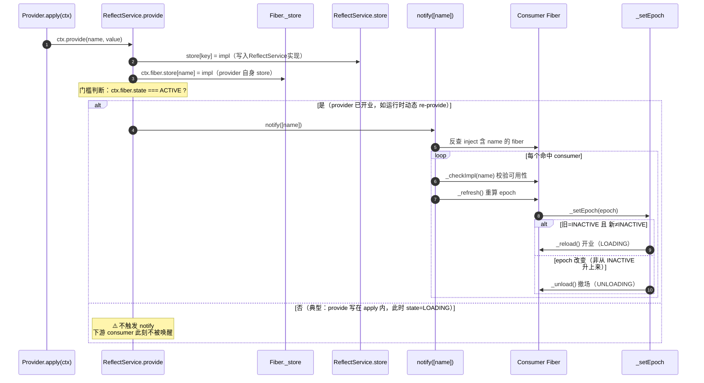

## context
如上，这个小故事，就是Cordis插件的核心运作机制；

大楼就是所有插件的顶层容器`Context`；
招商办公室即是`registry`，所有的插件注册要通过regisry；
楼管则是`reflect`，任何插件的状态变化，都由`reflect`来通知`fiber`做依赖核对，满足条件就上岗营业；
`events`是挂在`Context`上的事件系统，提供`emit` / `parallel` / `serial` / `bail` / `waterfall`**五种分派模式**，驱动各个插件协同工作；
店长就是`fiber`，提供服务时，对外部资源产生的影响要通过`effect`来注册，并返回擦除影响的方法；

```ts
export interface Context {
  ...
  root: this
  /** Base URL used to resolve relative plugin/module specifiers, if the runtime sets one. */
  baseUrl?: string
  /** The event bus. Its methods are also mixed onto `ctx` (`ctx.on`, `ctx.emit`, ...). */
  events: EventsService
  /** The logging service. Call `ctx.logger(name)` for a named logger. */
  logger: LoggerService
  /** The reflection layer backing the context proxy (`ctx.get`, `ctx.provide`, ...). */
  reflect: ReflectService
  /** The plugin registry. Its methods are mixed onto `ctx` (`ctx.plugin`, `ctx.inject`). */
  registry: RegistryService
}
```

`Context`在顶层定义中持有一个根级别的`fiber`对象，这个fiber其实没有内容；
初始化`Context`的时候，得到的ctx其实是有RelectService的代理。
```ts
//context 初始化：根 fiber 的 inject 为空集合，_refresh() 算出的 epoch 是空串 '' 而非 INACTIVE，
//所以一开局就处于就绪（ACTIVE）状态
  constructor() {
    this[symbols.isolate] = Object.create(null)
    this[symbols.intercept] = Object.create(null)
    const self = new Proxy<this>(this, ReflectService.handler)
    this.root = self
    this.baseUrl = undefined
    this.fiber = new Fiber(self, {}, Object.create(null), null, () => [])
    this.reflect = new ReflectService(self)
    this.registry = new RegistryService(self)
    this.events = new EventsService(self)
    this.logger = new LoggerService(self)
    this.fiber._disposables.clear()
    return self
  }

  [Symbol.for('nodejs.util.inspect.custom')]() {
    return `Context <${this.fiber.name}>`
  }
```
## plugin
所有插件定义，需要声明自己是谁，自己需要什么服务(可选)，自己执行服务的核心逻辑；
```ts
declare module '@deepseek-ai/cordis' {
  interface Context {
    sell: (cups: number) => void
  }
}

export const coffeePlugin = {
  name: 'coffee',
  inject: ['water', 'power'] as const,
  async apply(ctx: Context) {
    // 开业流程：每次依赖就绪都会「重新走一遍」——本班营业账在此归零
    ...

    // 协议附件登记撤场处理（LIFO：后登记的先执行）
    ctx.effect(() => () => ctx.logger.info('撤场：摘下门口的画'))
    ctx.effect(() => () => ctx.logger.info('撤场：停掉订阅的报纸'))
    ...

    ctx.provide('sell', sell)

    // 退租清理：依赖消失时这段被调用，从最后一项往回执行
    return () => {
      ctx.logger.info('咖啡店停业（本班营业账 ' + shiftNote + ' 杯作废；财务部总账仍在）')
    }
  },
}
```

插件通过`registry`提供的`plugin`方法注册，通过`inject`来声明依赖，这里的依赖是对服务的依赖；
插件通过`ctx.plugin`注册时，会检查依赖能否被满足，不满足的话就进入PENDING状态，直到服务满足后变成ACTIVE；
```ts
// 注册插件，返回与 fiber 绑定的 PromiseLike（其 .then 委托给 fiber.await()）
const coffee = ctx.plugin({
  name: 'coffee',
  inject: ['water', 'power'],   // 开业条件条款（依赖）
  apply(ctx) { /* 依赖就绪后才执行，即真正的开业 */ },
})
```

如果要让别的插件使用你的服务，需要要把自己提供的服务扩展到`context`中(如下declare的内容)，并且在你的插件ready的时候，主动将服务`provide`出来，或者使用扩展Service的方式来声明你的插件；
对外提供的服务，要通过`declare`的方式扩展到Context中，不然别的插件代码使用你的服务是，代码会飘红；
```ts
declare module '@deepseek-ai/cordis' {
  interface Context {
    sell: (cups: number, seller?: string) => void
  }
}

export const coffeePlugin = {
  name: 'coffee',
  inject: ['water', 'power', 'finance'] as const,
  async apply(ctx: Context) {
    ...

    ctx.provide('sell', sell)

    ...
  },
}
```

### 插件声明的3种方式
插件声明有三种方式，函数、对象、Service

#### 函数插件

首先是函数插件，如下即是最方便的函数插件，大部分只需要消费其他插件提供的服务能力的插件，通过函数形式定义即可
```ts
import { Service, type Context } from '@deepseek-ai/cordis'
const name = 'myplugin'
const inject = ['a','b']
export function apply(ctx: Context) {}
```

#### 对象插件
第二种是 对象插件，如下是在咱们的样例里使用的 coffeePlugin(瑞迪星集团)
```ts
// coffee.ts:17-19
export const coffeePlugin = {
  name: 'coffee',
  inject: ['water', 'power'] as const,   // ← 开业条件条款：缺一项 apply 不跑
  async apply(ctx: Context) { ... }      // ← 依赖就绪后才执行，即真正的开业
}
```
对于coffee这类业务插件，通过如上注册，等待Cordis的调度，满足依赖条件之后，开始运行自身的逻辑就可以了；
如果希望你的插件服务也可以被其他插件使用，比如咱们的例子里，面包店希望和咖啡店合作，卖咖啡，coffee就需要把自己的能力在apply的时候`provide`出来；
```ts
ctx.provide('sell', sell)            // ← 把「咖啡店 fiber」也挂出去，方便楼外 await
```
如果你的插件不对外提供服务，使用对象插件或者更方便的函数插件的方式就可以了。

#### Service 插件：
第三张就是Service类型的插件，Service插件除了自身往context注册外，还会将Service扩展到context，以供其他插件调用服务；
可以看到Service类的的构造函数中调用了`reflect.provide`;
```ts

export abstract class Service<out T = never> {
  //Service类构造函数构造函数
  constructor(protected ctx: Context, name: string) {
    name ??= this.constructor['provide'] as string
    ...
    self.ctx.reflect.provide(name, self, this[symbols.check])
    return self
  }
}
```

比如咱们的WaterService的supply方法，提供给依赖他的插件来调用；
```ts
export class WaterService extends Service {
  constructor(ctx: Context) {
    super(ctx, 'water')
    ctx.logger('water').info('供水部门挂牌（大厦公用）')
  }
  supply(): string {
    return '自来水'
  }
}
```


### Fiber
插件注册后，得到的是`fiber`对象，也就是上面故事里的店长，`fiber`是插件注册到`Context`后的真正运行对象；

```ts
// fiber（店长）—— 插件注册到 Context 后的真正运行对象，由 registry 在受理申请时 new 出来
class Fiber {
  // ① 开业条件条款（门禁）：声明需要哪些服务，缺一项 apply 不跑，咖啡店停在 PENDING
  inject: string[]

  // ② 生命周期状态机：状态由 epoch 跃迁 + _error + 是否 disposed 共同决定
  //    DISPOSED(dispose 已调) / FAILED(_reload 抛错，_error 被记) / ACTIVE(依赖齐) / PENDING(epoch=INACTIVE)
  //    LOADING · UNLOADING 是开业 / 撤场进行中的瞬态
  //    注：uid 只是 epoch 字符串里编码"依赖来自哪个 provider"的片段，不是独立参与状态计算的变量
  get state(): FiberState

  // ③ 开业流程本体：就是插件写的 apply，只有依赖就绪（epoch 翻成非 INACTIVE）时
  //    fiber 自己 _reload() → _execute(runtime.callback) 才执行——"依赖齐了才开业"是 fiber 决定的
  runtime: { callback: (ctx, config) => void }

  // ④ 撤场清单：所有 ctx.effect 登记项都收进这里，退租时倒序（LIFO）执行
  _disposables: DisposableList
  dispose(): PromiseLike<void>

  //⑤  决策权在 fiber 自己：reflect 通知依赖变了，fiber 读自己的 store 自己翻牌
  //    依赖齐 → _reload 开业；依赖没 → _unload 撤场（reflect 只传声，不喊开业）    
  _refresh(): void
  _setEpoch(epoch: string): void
  _reload(): PromiseLike<void>
  _unload(): PromiseLike<void>
  _checkImpl(name: string)

}
```

#### Provide
插件注册后，如果要对外提供服务，如咱们之前所说，是要通过provide来激活服务的(挂牌)，

```ts
  //reflect provide & notify
  provide(name: string, value?: any, check?: () => boolean) {
    return this.ctx.fiber.effect(() => {
      if (!this.props[name]) {
        this.props[name] ??= { type: 'service' }
      } else if (this.props[name].type !== 'service') {
        throw new Error(`property "${name}" is already declared as ${this.props[name].type}`)
      }
      this.props[name] = { type: 'service' }

      this.ctx.root[symbols.isolate][name] ??= Symbol(name)
      const key = this.ctx[symbols.isolate][name]
      const impl: Impl = { name, value, fiber: this.ctx.fiber, check }
      if (this.store[key]) {
        throw new Error(`service "${name}" has been registered at <${this.store[key].fiber.name}>`)
      }
      this.store[key] = impl
      this.ctx.fiber.store![name] = impl
      if (this.ctx.fiber.state === FiberState.ACTIVE) {
        this.notify([name])
      }
      return async () => {
        delete this.store[key]
        const fibers = this.notify([name])
        await Promise.allSettled(fibers.map(fiber => fiber.await()))
        // ensure self access before dependencies cleanup
        delete this.ctx.fiber.store![name]
      }
    }, `ctx.provide(${JSON.stringify(name)})`)
  }

  notify(names: string[], filter = (ctx: Context, name: string) => ctx[symbols.isolate][name] === this.ctx[symbols.isolate][name]) {
    const fibers: Fiber[] = []
    for (const runtime of this.ctx.registry.values()) {
      for (const fiber of runtime.fibers) {
        let hasUpdate = false
        for (const name of names) {
          if (!(name in fiber.inject)) continue
          if (!filter(fiber.ctx, name)) continue
          hasUpdate = true
          fiber._checkImpl(name)
        }
        if (!hasUpdate) continue
        fiber._refresh()
        fibers.push(fiber)
      }
    }
    for (const name of names) {
      const self: Context = Object.create(this.ctx)
      self[symbols.filter] = (target: Context) => filter(target, name)
      this.ctx.events.emit(self, 'internal/service', name, this._getImpl(name, false)?.value)
    }
    return fibers
  }
```
整个激活的过程是一个级联检查的过程，如下，

某个插件的服务ready后，通过调用 ctx.provide(name, value)，新挂牌提供的服务作为自身(fiber)的副作用注册，服务名称必须唯一，
新provide的服务信息写入fiber自己的store和reflectService的store中供后续的状态变更和全局检查是使用；
写完后卡一道门槛，只有提供服务的fiber自己已经 ACTIVE（开业状态）时，才触发 notify([name])。

notify 拿着服务名，只扫那些 inject 里声明要这个服务的 consumer fiber（不扫全场），逐个调 _checkImpl 校验、再 _refresh 重算consumer自己的 epoch。
consumer 自己翻牌：_refresh 算出新的 epoch 交给 _setEpoch，开不开业由 consumer 自己定——从"缺依赖"变"齐了"就 _reload 开业；反之就 _unload 撤场。
reflect 只传声，不拍板。
若 consumer 开业时又 `provide` 新服务，就进入下一轮 `notify`，形成级联。



## effect & dispose（副作用与清理）

插件正式提供服务后，对外部资源产生的影响，在cordis里叫做副作用，通过在 `apply` 里通过调用 `ctx.effect(fn)`来声明，框架会立刻执行 `fn()`，并把 `fn` 返回的清理函数收进该插件 fiber 的 `_disposables`；插件依赖消失（撤场）时，框架倒序（LIFO）执行这些清理函数，就是 `dispose`。

在咱们提供的样例里，咖啡店服务激活后，在公告牌里写上自己的服务信息，返回的是从公告牌抹去自家服务信息的函数；

```ts
// common.ts —— trackEffect：登记/注销都在 effect 回调里
export function trackEffect(ctx: Context, owner: string, label: string, fn) {
  return ctx.effect(() => {
    ctx.board.add(owner, 'effect', label)     // effect 建立 → 登记
    const dispose = fn()
    return () => {
      if (typeof dispose === 'function') dispose()
      ctx.board.remove(owner, 'effect', label) // effect 清理 → 注销
    }
  }, owner + ': ' + label)
}
```


## events
Cordis 的 event 有五种分派模式：`emit` / `waterfall` / `parallel` / `serial` / `bail`。**用哪种由发送方决定**，不是订阅方。

和 Service 一样，对外可订阅的通知也要先 `declare` 到 `Events` 接口，否则消费方代码会飘红：
```ts
declare module '@deepseek-ai/cordis' {
  interface Events {
    'water/maintenance'(message: string): void
  }
}
```

挨个看。

### emit
纯广播，发完不等待任何返回值。样例里供水商发停水通知就是 emit——怎么应对是各家自己的事，供水商不管。
```ts
// 发送方：发完即走
ctx.emit('water/maintenance', '今晚18:00 停水')

// 订阅方（coffee.ts）：直接用 ctx.on，区别只在发送方用的是 emit
ctx.on('water/maintenance', (message) =>
  ctx.logger.info('[咖啡店] 收到停水通知：' + message + ' → 提前蓄水'),
)
```
DSH的场景里大量使用了emit来广播agent状态的变化，，典型有AGENT状态的变化，工具注册表变动，提示词变化等等；

### waterfall
发送方发一个初始值，**逐层转包给订阅方**，每个订阅方拿到上一层结果，调 `next()` 交给下一层，最终返回最外层的结果。任一层**不调 `next()` 就等于否决**后续链路（含内置行为）。
```ts
// 发送方（03-events.ts）：把基础电费涨幅层层转包
const rise = ctx.waterfall(
  'power/price-rise',
  '基础电费 +10%',
  (note) => '供电科公告：' + note,   // 内置最内层行为
)

// 订阅方（coffee.ts）：直接用 ctx.on，包裹 next()，在上一层结果后追加自己的转嫁说明
ctx.on('power/price-rise', (note, next) => {
  const r = next()                       // 先让内层/下游处理
  return r + '；[咖啡店] 每杯转嫁 ¥1'   // 再叠加自己的改动，回传上层
})
```
**DSH 场景**：waterfall 是 DSH 里**用得最多的模式**，承载"可插拔的流水线变换"：
- 拼装系统提示词，各插件经 `next()` 追加/改写 section、context、tools。。
- 文件编辑/写入前的**单槽位门禁**。
等等

### parallel
发送方并发派发事件，**等待所有订阅方都处理完（回执）才继续**。语义上等于"我发出的事，必须每家都确认过了"。
```ts
// 发送方（03-events.ts）：同一停水通知改用 parallel —— 等所有订阅方处理完才返回
await ctx.parallel('water/maintenance', '今晚18:00 停水')
console.log('parallel 已返回：所有订阅方都已处理')

// 订阅方：和 emit 一样用 ctx.on，只是这次处理函数会被 await —— 发完所有订阅方才算返回
ctx.on('water/maintenance', async (message) => {
  await ctx.logger.info('[咖啡店] 收到停水通知：' + message + ' → 提前蓄水')
})
```
**DSH 场景**：DSH 核心代码里**几乎不用裸 `parallel`**。

### serial
发送方按注册顺序**逐个**调订阅方，**一旦某个订阅方返回非空值就立刻停**（其余不再执行），并把该值回传。适合"征求意见、首个有效答复即拍板"。
```ts
// 发送方（03-events.ts）：停电前征求意见，首个非空意见即命中
const vote = await ctx.serial('power/outage-vote', 3)

// 订阅方（coffee.ts）：直接用 ctx.on，返回非空即命中，后续订阅方不再被调用
ctx.on('power/outage-vote', (floor) => {
  ctx.logger.info('[咖啡店] 对 ' + floor + ' 楼停电投票：不同意（建议错峰）')
  return '咖啡店：不同意，建议错峰'
})
```
**DSH 场景**：比如turn结束前放serial，hook插件订阅，只要有任意的hook需要检查，就不停；

### bail
和 serial 一样"首个非空值即停"，但**同步**返回。适合"抢占/认领"：谁先返回非空谁赢，后面的不再执行。
在DSH中，bail 集中在客户端输入处理。