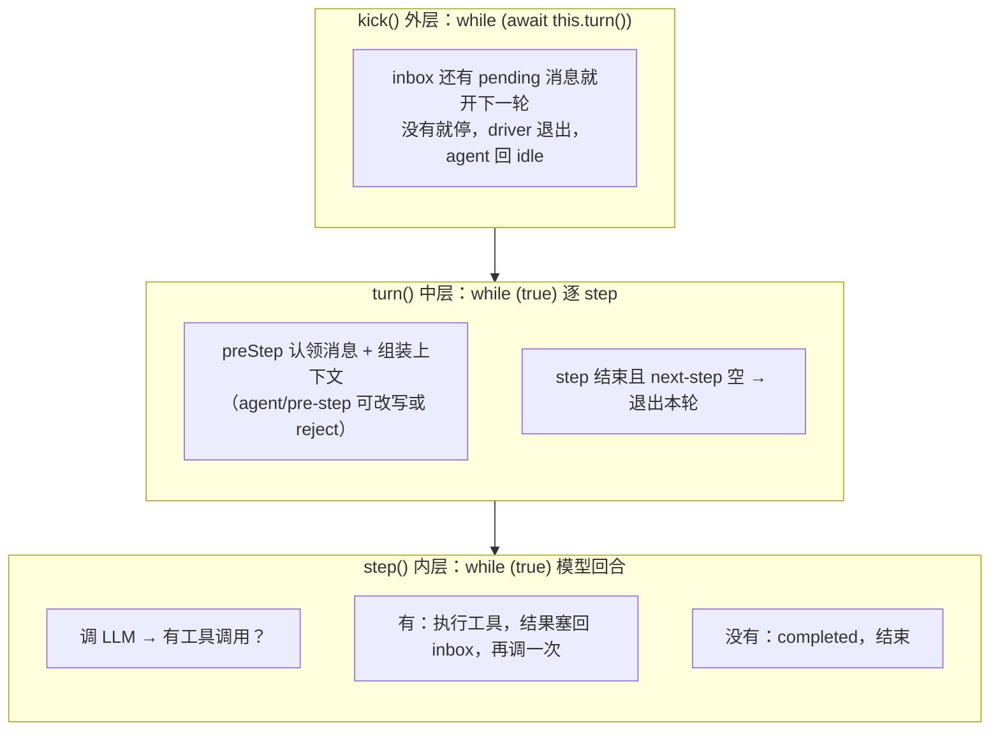

# DSH · Agent Loop 怎么转

一句话：**agent 的循环就是三层 while 嵌套——外层管"开几轮"，中层管"一轮跑几步"，内层管"一次模型回合转几圈"；所有插件的活儿，都挂在循环边上这些事件接缝上。**

主循环逻辑在 `packages/core/agent-loop/src/agent.ts` 的 `ReactLoopAgent` 类，一个文件装下整个循环骨架。同包 `index.ts` 里的 `AgentLoop` 服务只是工厂（创建/恢复/销毁 agent），不参与循环本身。

## 三层循环

**外层 kick()**：`while (await this.turn())`。turn 返回 true 说明 inbox 还有活，继续下一轮；返回 false 说明空了，driver 退出，agent 回到 idle。消息入口：`followup()` 发到 next-turn（开新的一轮），`steer()` / `inject()` 发到 next-step（插到当前轮中间）。注意 steer 和 followup 带唤醒，inject 不唤醒——注入只进队列，不会把 idle 的 agent 拉起来。

**中层 turn()**：一轮请求的处理周期。内部 `while (true)` 一个 step 一个 step 跑，每次 step 前有 `preStep()`：从 inbox 认领消息、组装 system prompt 和上下文、跑 `agent/pre-step` waterfall 让插件有改写或拒绝的机会（reject 就以 blocked 结束本轮）。退出条件两个都要满足：本轮已有结束原因（completed 或 max-tokens），且 next-step 队列空。工具结果塞回来的、steer 插进来的消息都会让 next-step 非空，所以会继续。

**内层 step()**：一次模型回合。`while (true)` 里做的事：调一次 LLM → 流式收 chunk 落 session → 看模型有没有要工具调用。没有 → completed 返回；有 → 交给 `tool-calls.ts` 的 `executeToolCalls()` 执行（默认最多 10 个并行），结果以 context 形式塞回 next-step inbox，然后继续调模型。所以内层循环的终止条件就是**模型不再要工具了**。max-tokens 是"粘性"的——某一步撞了上限，后面正常结束的 step 也不能把本轮结果降级成 completed。

## inbox：双队列

inbox（`packages/core/agent/src/inbox.ts`）有两个队列：`next-turn` 和 `next-step`。认领时先认领全部 next-step，再按需取一条 next-turn——所以 steer 进来的消息天然插在下一轮之前。消息被认领、插入、丢弃时分别发 `agent/inbox/claimed`、`agent/inbox/inserted`、`agent/inbox/discarded` 通知。

## 上下文管理：投影 + 压缩 + 溢出

循环骨架之外，上下文这条线有三层，全是插件。

**第一层：RuntimeContextProjection（agent-loop 包内）。** system prompt 在 dsh 里拆两半：sections 是"岗位说明书"（persona、指令），每步重新渲染进 system 字段，不进历史；contexts 是动态上下文（provider、model、cwd、时间这类运行时状态）。投影做的事：每步把 contexts 渲染成一份快照，开头固定是 `Current runtime context...`，然后和上一条已提交的快照比对——**内容没变就不发，变了才追加一条 plugin 来源的 user/message 进对话历史**。被 compaction 的 replace 盖掉就标记失效，下次重新投影。为什么要绕一圈做成消息而不是拼进 system prompt？三个原因：可持久化可重放（断点恢复时历史里带着每阶段状态）、可被 compaction 压缩（塞 system 里压缩碰不到）、变化驱动防膨胀。

**第二层：compaction（独立包 `packages/compaction/`）。** 真正的上下文压缩，两个触发口正好挂在两个 waterfall 接缝上：`agent/pre-step` 上用 tokenMeter 量压力，超过 thresholdRatio 就压缩（pressure 触发）；`agent/request-error` 上遇到 CONTEXT_WINDOW_EXCEEDED 就压缩后返回 retry 重发（context-overflow 触发）。压缩干的事：把一段历史用 LLM 总结成摘要（`compaction/summary` 事件），再用一条新的 user/message 做表面替换把那段盖掉。只记日志事件 + 改表面，原始记录不删，可重放。自动跑要配 `auto: true`，也有手动命令（command-compact 包）。

**第三层：spill（`packages/spill/`）。** 工具输出太大时，把全文写到会话目录的文件里，上下文只放路径和检索指引——防止单条工具结果直接撑爆窗口，挂在 `tools/post-execute` 上。

另外 `packages/guard/` 是循环卫生插件：重复工具调用提醒（repeat-tool-reminder）、工具超时强制（timeout-policy）。

## 事件接缝：四种口味

插件挂接循环的方式分四类，语义不同：

- **waterfall（洋葱链，可拦截/改写/拒绝）**——主流程的钩子全是这类：`agent/pre-step`（step 前，可追加消息或 reject）、`agent/request`（模型调用前，可改 provider/model/参数）、`agent/request-error`（失败时决定 retry 还是抛错）、工具前后 `tools/pre-execute` → `tools/execute` → `tools/post-execute`（spill 就挂这）、`tools/code-dispatch-log`。
- **serial（排队执行，不可改写）**——只有 `agent/turn-stopping` 一个，turn 结束前最后通告一次。注意它只在"已有结束原因且 next-step 空"时触发，aborted/error 路径不经过它。
- **emit（广播通知）**——`agent/created`、`agent/session-start`、`agent/status`（idle↔running）、`agent/error`、`agent/disposed`、`agent/inbox/*`、`agent-loop/config-start-failed`、`tools/result`、`tools/change`。只是通知，拦不住事。
- **session 日志事件**——`session.append` 落库后经 `session/event` 订阅：`turn/start`、`turn/end`、`step/start`、`step/end`、`user/message`、`assistant/chunk`、`assistant/message`、`tool/call`、`tool/result`、`request/header`、`request/context`、`agent/inbox/spliced`、`todo/write`、`compaction/start`、`compaction/summary`、`compaction/end`、`compaction/prune`。先写历史再广播，只能看不能拦。

## 两个贯穿性的设计

**一切请求从 session log 派生。** turn/start、step/start、assistant/chunk、tool/call 这些事件全部追加进 session，下一次请求的 messages 从 session 重放出来。这是它能断点恢复的根基，也是 RuntimeContextProjection 和 compaction 都要以"消息"形式工作的原因——只有进了历史的东西，才能被重放、被压缩。

**循环本身只有骨架，所有"智能"都是插件插进去的。** 想在请求前改模型配置？挂 `agent/request`。想在工具结果进上下文前换掉它？挂 `tools/post-execute`。想自动压缩上下文？挂 `agent/pre-step` 和 `agent/request-error`。想盯每一轮的状态？挂 `agent/status`。这就是 dsh 那句 "everything is a plugin" 在循环上的体现。
