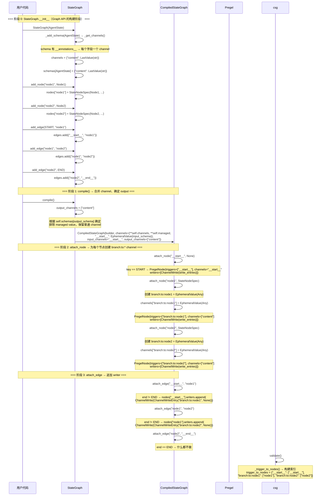

 
# Pregel 介绍
LangGraph工作流引擎是基于Google的Pregel论文设计的，LangGraph把他叫做**Pregel引擎**

## Actor and Channels

Pregel将工作流分为两大角色 **Actor** 和 **Channel**，Pregel引擎将Actor和Channel串联起来形成一个完整的应用。
- **Actor** 承载具体的节点执行逻辑，从Channel中读取数据，执行逻辑的最终输出也会写入到Channel中，Actor在LangGraph里即是**PregelNode**；

- **Channel** 负责Actor之间的通信，通过Channel在不同的**PregelNode**之间共享数据，每个Channel都包含Channel的**类型，Channel的更新类型和更新方法**三个重要的属性；你定义的在AgentState中的每一个属性，在编译Workflow的阶段，都会生成一个单独的channel；

比如如下的一个简单的Workflow，包含两个节点node1和node2:

```python
class AgentState(TypedDict):
    content: str

def Node1(state: AgentState) -> dict:
    return {'content': 'node1'}

def Node2(state: AgentState) -> dict:
    return {'content': 'node2'}

graph = StateGraph(AgentState)
workflow = graph.add_node("node1",Node1)\
					.add_node("node2",Node2)\
					.add_edge(START,"node1")\
					.add_edge("node1","node2")\
					.add_edge("node2",END).compile()
					
print('####nodes:\n')
pprint(workflow.nodes)

print('####channels:\n')
pprint(workflow.channels)
```

将graph的nodes和channels print到控制台，可以看到如下信息，每个添加到图里的Node的类型都是PregelNode(start也是一个独立的node)，而每个Node之间的边和AgentState中的属性，都是独立的Channel:
```shell
####nodes:

{'__start__': <langgraph.pregel._read.PregelNode object at 0x1061201a0>,
 'node1': <langgraph.pregel._read.PregelNode object at 0x1060b5d10>,
 'node2': <langgraph.pregel._read.PregelNode object at 0x1060b6350>}

####channels:
{'__pregel_tasks': <langgraph.channels.topic.Topic object at 0x106140980>,
 '__start__': <langgraph.channels.ephemeral_value.EphemeralValue object at 0x106140900>,
 'branch:to:node1': <langgraph.channels.ephemeral_value.EphemeralValue object at 0x106140bc0>,
 'branch:to:node2': <langgraph.channels.ephemeral_value.EphemeralValue object at 0x1059f6840>,
 'content': <langgraph.channels.last_value.LastValue object at 0x102db2200>}
```

再看看PregelNode包含哪些属性，其中
- channels，表示要传入到Node执行逻辑的channels有哪些，bound会取出这些channels的值执行node定义的业务逻辑；
- triggers，表示该Node订阅的channel，用于触发node的执行逻辑；
- writers，表示PregelNode的业务逻辑执行完成之后，通过writers来向对应的channel写入更新；

```python
class PregelNode:
    """A node in a Pregel graph. This won't be invoked as a runnable by the graph
    itself, but instead acts as a container for the components necessary to make
    a PregelExecutableTask for a node."""

    channels: str | list[str]
    """The channels that will be passed as input to `bound`.
    If a str, the node will be invoked with its value if it isn't empty.
    If a list, the node will be invoked with a dict of those channels' values."""

    triggers: list[str]
    """If any of these channels is written to, this node will be triggered in
    the next step."""

    mapper: Callable[[Any], Any] | None
    """A function to transform the input before passing it to `bound`."""

    writers: list[Runnable]
    """A list of writers that will be executed after `bound`, responsible for
    taking the output of `bound` and writing it to the appropriate channels."""

    bound: Runnable[Any, Any]
    """The main logic of the node. This will be invoked with the input from 
    `channels`."""
    
    ...
```


看看咱们这个最简单的workflow的nodes的这些属性是怎样的，比如node1，
- channels, 订阅了AgentState的`content`属性，表示这个channel会作为node1执行逻辑的输入，如果AgentState有多个属性，每个属性都会作为独立的channels出现在node的channels订阅列表中；
- triggers，订阅的是`branch:to:node1`，这个订阅的来源是在生成graph中的`add_edge`指定得来的；
- writes，将Node逻辑执行完成后的返回，写入到对应channel的runnable对象；

```shell
***node: node1:
node1 subscribe channels: ['content']
node1 triggers: ['branch:to:node1']
node1 writers:
[ChannelWrite<...,...>(tags=None, recurse=True, explode_args=False, func_accepts={'config': ('N/A', <class 'inspect._empty'>)}, writes=(ChannelWriteTupleEntry(mapper=<function CompiledStateGraph.attach_node.<locals>._get_updates at 0x10614c680>, value=<object object at 0x102c86580>, static=None), ChannelWriteTupleEntry(mapper=<function _control_branch at 0x1061379c0>, value=<object object at 0x102c86580>, static=[]))),
 ChannelWrite<branch:to:node2>(tags=None, recurse=True, explode_args=False, func_accepts={'config': ('N/A', <class 'inspect._empty'>)}, writes=(ChannelWriteEntry(channel='branch:to:node2', value=None, skip_none=False, mapper=None),))]
```

如我们开头所说，每个channel都有值类型，更新类型，和更新方法，从workflow的输出，我们可以看到，
- AgentState的content属性，是last_value类型，他表示这个类型的channel接受的是每个node节点逻辑处理完成之后的最终值，即表示如果node的处理逻辑最终返回了需要更新这个属性值，这个属性值会被最新的值刷新；
- Workflow的边被定义为 ephemeral_value，这个表示瞬时值，这个channel基本只用于node的trigger订阅；
```shell
{'__pregel_tasks': <langgraph.channels.topic.Topic object at 0x106140980>,
 '__start__': <langgraph.channels.ephemeral_value.EphemeralValue object at 0x106140900>,
 'branch:to:node1': <langgraph.channels.ephemeral_value.EphemeralValue object at 0x106140bc0>,
 'branch:to:node2': <langgraph.channels.ephemeral_value.EphemeralValue object at 0x1059f6840>,
 'content': <langgraph.channels.last_value.LastValue object at 0x102db2200>}
```

## channel还包含哪些类型呢 

### topic
从workflow.channels，可以看到workflow包含一个特殊的channel 对象，使用的是Topic channel类型: 
`'__pregel_tasks': <langgraph.channels.topic.Topic object at 0x106140980>`，

`__pregel_tasks` 是 LangGraph 内部用于**任务调度和控制**的一个核心通道（Channel），它使用了 `Topic` 类型，
1. **内部调度**：Pregel 需要一种方式来决定接下来要执行哪些节点。当一个节点在执行过程中（或在边逻辑中）决定要触发后续任务时，它会将这些“任务描述”（即“在下一个 superstep 中要运行哪个节点”、“用什么输入”等）推送到 `__pregel_tasks` 通道中。
2. **Topic 的特性**：在 LangGraph 中，`Topic` 是一种特殊的通道类型，它允许积攒（accumulate）多个写入操作。因为在一个 superstep 中，可能有多个节点同时触发新的任务，或者同一个节点触发了多个任务，`Topic` 保证了这些任务写入不会互相覆盖，而是被收集成一个列表（Sequence），供运行时在下一个 superstep 开始时统一读取并派发。
Topic channel在workflow 里一般不直接使用。

我们看看Workflow运行用得最多的channel类型，
- **Last_value**，AgentState的默认channel类型，每个node执行完成时覆盖写入；
- **`BinaryOperatorAggregate`**，指定了值更新方式的channel类型，按照指定的规约方法进行值的合并，比如定义AgentState属性时，通过Annotated指定了值的更新方式；

```python
class AgentState(TypedDict):
	content: Annotated[str,lambda old,new: old +new]
```

查看 content的channel类型:
```shell
 'content': <langgraph.channels.binop.BinaryOperatorAggregate object at 0x107cec7c0>}
```

Last_value和BinaryOperatorAggregate就是绝大部分工作流的场景用到的channel类型了，

此外，值得关注的还有**DeltaChannel**，DeltaChannel比较有用的一个场景就是在Workflow处理的场景，不断需要与AI交互时存储message的场景，因为workflow的checkpoint保存的是node执行完成的完整快照，如果message在各个node之间在传递，那么每个checkpoint都会保存很多冗余的message信息，而DeltaChannel在checkpoint快照中保存的是每个步骤写入的新消息，读取时才会去读取完整的消息列表，从而降低了对空间的消耗；


### 编译期：Graph 是怎么变成 Actor + Channel 的

下面这张图展示 `StateGraph` 在 `compile()` 时，如何一步步被拆解成 Pregel 的 Actor（PregelNode）和 Channel。先看编译，再回头看运行时的三步，整条链路就通了。



### 运行时：每一步的 Plan → Execution → Update

工作流运行时的每一步，都是在执行 **Plan → Execution → Update** 三个阶段：

- **Plan（规划）**：扫描所有 Channel，找出"上一步被更新过的 Channel 所订阅的 PregelNode"。第一步没有"上一步"，所以触发的是订阅了 input channel（`__start__`）的节点。
- **Execution（执行）**：把上一步 Plan 选出来的节点**并行**跑起来，各自从订阅的 Channel 读输入、执行逻辑，把结果写入自己的 writes 列表。这一步里任何节点对 Channel 的写入，对其他节点**都不可见**——大家看到的还是上一步的快照。
- **Update（更新）**：等这一批节点全部跑完，再把它们 writes 列表里的写入**统一刷进对应的 Channel**，并清除本步的瞬时值。到这一步，新的状态才对其他节点可见，进入下一个 superstep。

正是这个"本步隔离、下一步才可见"的约束，让 Pregel 的执行结果可复现——同一张图、同样的输入，每次跑出来的步骤和结果都一样。

# 直接使用Pregel创建工作流

```python

from langgraph.pregel import Pregel, NodeBuilder
from langgraph.channels import EphemeralValue, Topic

def node1_func(x: str) -> str:
    return x + x

def node2_func(x: dict) -> str:
    return x["b"] + x["b"]

# 构建两个节点
node1 = (
    NodeBuilder()
    .subscribe_only("a")
    .do(node1_func)
    .write_to("b", "c")
)

node2 = (
    NodeBuilder()
    .subscribe_to("b")
    .do(node2_func)
    .write_to("c")
)

app = Pregel(
    nodes={"node1": node1, "node2": node2},
    channels={
        "a": EphemeralValue(str),
        "b": EphemeralValue(str),
        "c": Topic(str, accumulate=True),
    },
    input_channels=["a"],
    output_channels=["c"],
)

result = app.invoke({"a": "foo"})
print(result)
```

如上是LangGraph 源码中提供的使用Pregel直接创建工作流的示例，从工作流的定义可以看到，创建Pregel工作流时，指定了工作流运行时的Channels: a / b / c ，分别是Ephemeral 和 Topic类型 (并且是累计类型)，而后指定了 输入、输出channels 分别是 a  和 c；

通过NodeBuilder创建node时，指定node的订阅channel，执行逻辑和输出channel，比如 node1订阅了channels a，执行 node1_func 的逻辑处理输入值，输出值写入到topic类型的channel c；

注意，输出channel是accumulate的topic，因此在node1和 node2往 channel c写入的值，都会输出到最终的执行结果

```shell
{'c': ['foofoo', 'foofoofoofoo']}
```


# 总结
如上就是LangGraph 工作流底层引擎Pregel的一些基本内容，回顾一下要点:

- **Pregel 是 LangGraph 的运行时**，名字来自 Google 的 Pregel 论文，跑的是 BSP（批量同步并行）模型。你平时写的 Graph API，编译后本质上就是一套 Pregel 应用。
- **两个角色：Actor 和 Channel**。Actor 就是 PregelNode，装着节点的执行逻辑，从 Channel 读输入、把结果写回 Channel；Channel 负责节点之间传数据，每个 Channel 都有值类型、更新类型、更新方法这三个属性。
- **编译期的映射关系是理解 Pregel 的关键**：State 里每个字段编译成一个 Channel；每条边编译成一个 `branch:to:*` 的 EphemeralValue Channel；每个节点（含 START）编译成一个 PregelNode。你写的是 add_node / add_edge，引擎在背后把它拆成了一堆 Actor 和 Channel。
- **PregelNode 三要素**：`channels`（读哪些 Channel 当输入）、`triggers`（订阅哪些 Channel，被写就触发自己执行）、`writers`（执行完往哪些 Channel 写结果）。
- **常用的 Channel 类型**：LastValue（默认，覆盖写，只留最后一次的值）、BinaryOperatorAggregate（按你给的 reducer 规约合并）、Topic（PubSub，可累加多个写入）、EphemeralValue（瞬时值，主要给边做 trigger 用）。消息类的大 State 想省 checkpoint 空间，可以用 DeltaChannel（只存每步增量，langgraph 1.2+，目前还是 beta）。
- **每一步都在做 Plan → Execution → Update**：Plan 找出订阅了"上一步被更新的 Channel"的节点（第一步是订阅 input channel 的节点）；Execution 把这些节点并行跑完，而且本步的写入对其他节点不可见，要到下一步才生效；Update 再把这一步的写入统一刷进 Channel。如此循环，直到没有节点可跑。这个"本步隔离、下一步才可见"，正是 BSP 保证执行确定性的关键。
- **可以直接用 Pregel + NodeBuilder 手搓工作流**，但 99.99% 的场景用 Graph API 就够了，不用碰底层。


更详细的内容参考官方文档，[Pregel](https://docs.langchain.com/oss/python/langgraph/pregel)

