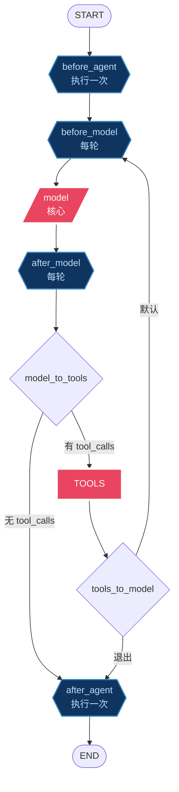

# 实战：Middleware —— 在 Agent 每一步插进自己的逻辑
在进入通过LangGraph构建Agent Loop之前，我们先看看langchain框架提供的一个重要的机制，`Middleware`；
一个生产级 Agent 光有"模型 + 工具"不够，还需要上下文组装、记忆、停止控制、护栏这些横切能力。这些能力有个共同特点：它们都要"插在模型调用或工具调用的前后"。LangChain 的 `create_agent` 给了一套统一的插入点（hook），就是 **middleware**。

这一章把 middleware 机制讲透：六个 hook 长在哪、怎么写一个、怎么改流程走向、内置都送了哪些现成的。09 章侧重"Agent Loop 的设计思路（对比 Pi Agent）"，`create_agent-analysis.md` 侧重"源码层面这些 hook 怎么编译成图"——本篇是机制本身，建议先读本篇，再回头看那两篇。

## 一、middleware 是什么，不是什么

一句话：middleware 是 `create_agent` 提供的一组**生命周期 hook**，让你在 Agent 跑起来的每一步前后塞进自己的逻辑。

要注意它不是另一套运行时。middleware 的 hook 直接编译进 `create_agent` 返回的那个 `CompiledStateGraph` 里——该是 node 的就是 node，该是节点内部的拦截器就是拦截器。你甚至可以把整个 agent（middleware 连同）当一个子图塞进更大的 `StateGraph`，所有 hook 照样跑。

典型能干的活：
- 日志、埋点、调试（追踪每一步）
- 改 prompt、改工具选择、改输出格式
- 重试、降级、提前终止
- 限流、护栏、PII 脱敏

## 二、六个 hook 和它们的位置

`create_agent` 的循环是 `model → tools → model → ... → 没 tool_calls 就停`。middleware 在这条线的六个点上挂钩：

```
before_agent   （整个 agent 启动一次）
  └─ before_model   （每一轮循环，调模型前）
       └─ [model 调用]
       └─ after_model    （每一轮循环，调模型后）
            └─ 有 tool_calls → tools → 回到 before_model
            └─ 无 tool_calls → after_agent  （整个 agent 结束一次）
```

另外两类是"包裹"式的，不单独成 node：
- `wrap_model_call`：包住模型调用，能改 request / response（重试、短路、换模型都在这）
- `wrap_tool_call`：包住工具调用，能做参数校验、权限拦截、结果后处理

前四个 hook 在编译后会各自变成 graph 里的真实 node；后两个在 `model` / `tools` 节点内部以拦截链的形式执行。节点图见本章第八节。

## 三、写一个 middleware 有多简单

最轻量的写法是用装饰器。比如"每轮调模型前，把 steering 队列里的紧急消息塞进对话"：

```python
from typing import NotRequired
from langchain.agents.middleware import AgentState, before_model
from langchain_core.messages import BaseMessage
from langgraph.runtime import Runtime

class MyState(AgentState):
    steering_queue: NotRequired[list[BaseMessage]]

@before_model(state_schema=MyState)
def steering_middleware(state: MyState, runtime: Runtime) -> dict | None:
    steering = state.get("steering_queue", [])
    if not steering:
        return None
    return {
        "messages": steering,        # 合并进 state
        "steering_queue": [],        # 消费后清空
    }
```

几个点：
- hook 函数签名统一是 `(state, runtime)`，返回 `dict | None`。
- 返回的 dict 会**合并进 state**——想往对话加消息就返回 `{"messages": [...]}`，想改别的字段就返回那个字段。
- 什么也不做就返回 `None`。
- 自定义字段要先在 `state_schema` 里声明（继承 `AgentState` 加 `NotRequired` 字段）。默认 `AgentState` 自带 `messages`、`jump_to`、`structured_response` 三个字段。

`wrap_model_call` / `wrap_tool_call` 一般写成 `AgentMiddleware` 子类的方法，因为它们要包住"调用链"：

```python
from langchain.agents.middleware import AgentMiddleware

class MyMiddleware(AgentMiddleware):
    def wrap_model_call(self, request, handler):
        # 改 request
        result = handler(request)   # 真正调模型
        # 改 result
        return result
```

把 middleware 交给 agent 很简单：

```python
from langchain.agents import create_agent

agent = create_agent(
    model="gpt-4o-mini",
    tools=[...],
    middleware=[steering_middleware, MyMiddleware()],
)
```

如果你要同时定义多个 hook，直接写一个 `AgentMiddleware` 子类、把需要的 hook 写成方法即可，两种写法可以混用。

## 四、jump_to：在 hook 里改流程走向

光塞消息还不够，有时候你想直接改变流程——比如让 Agent 提前停，或者结束后接着干下一个任务。middleware 返回的 dict 里可以带一个 `jump_to` 字段，只有三个值：

- `"model"`：跳回模型调用，重启一轮循环
- `"tools"`：直接去执行工具
- `"end"`：直接结束

但有个坑：**middleware 默认不允许跳转**，你必须在装饰器上显式声明 `can_jump_to`，否则用了 `jump_to` 也不生效：

```python
@after_agent(state_schema=MyState, can_jump_to=["model"])
def followup_middleware(state, runtime):
    follow_ups = state.get("follow_up_queue", [])
    if not follow_ups:
        return None
    return {
        "messages": follow_ups,
        "follow_up_queue": [],
        "jump_to": "model",    # 重开循环
    }
```

`jump_to` 在 state 里是"用完即清"的临时值（EphemeralValue），不会残留在下一轮，所以放心用。

三个最常用的 jump_to 套路：
1. **steering（紧急插队）**：`before_model` 里注入消息，不改跳转，下一轮自然带上。
2. **followUp（任务追加）**：`after_agent` 里注入消息 + `jump_to="model"`，Agent 停下后又被拉起来接着干。
3. **硬停止**：`before_model` / `after_model` 里判断异常条件，返回 `jump_to="end"`，立刻终止（区别于 `interrupt()` 的"暂停等人工"）。

完整的 steering + followUp 可跑示例在 `src/baby_agent/agent.py`，09 章也用同一套代码讲了它在 Agent Loop 里的位置。

## 五、多个 middleware 怎么串

你传 `middleware=[A, B, C]`，它们不是平铺执行，而是按 hook 分区域串联，而且有顺序讲究：

```
before_agent:  A → B → C        （正序）
before_model:  A → B → C        （正序）
after_model:   C → B → A        （反序）
after_agent:   C → B → A        （反序）
```

before 类是正序（A 先 B 后），after 类是**反序**（C 先 A 后），像栈一样先挂的后执行。`wrap_*` 则是包成一条链：A 包 B 包实际调用，从外到内进、从内到外出。

实际节点数取决于你实现了哪些 hook：一个 middleware 实现了 `before_model`，就多一个 `before_model` 节点。比如 A、B、C 都实现全部 hook，编译出来的图会有 `3+3+1(model)+3+1(tools)+3 = 14` 个节点。`create_agent` 用 `is not` 比较对象身份来判断"这个 middleware 到底有没有重写某个 hook"，没重写的就不挂节点，避免空转。

想看这 14 个节点具体怎么连、条件边怎么路由，看 `create_agent-analysis.md` 的图结构详解。

## 六、内置 middleware 库

不用什么都自己写。`langchain.agents.middleware` 里已经带了一票现成的，按用途大致分几类：

- **可观测 / 调试**：日志、追踪（自己写也行，官方有埋点类）
- **prompt / 工具 / 输出变换**：`LLMToolSelectorMiddleware`（用 LLM 选工具）、`ContextEditingMiddleware`（编辑上下文）、`dynamic_prompt`（动态改 system prompt）
- **重试 / 降级 / 早停**：`ToolRetryMiddleware`、`ModelRetryMiddleware`、`ModelFallbackMiddleware`（主模型挂了换备胎）、`ModelCallLimitMiddleware`（限制调用次数，也用于早停）
- **护栏 / 限流 / 安全**：`PIIMiddleware`（PII 检测脱敏）、`HumanInTheLoopMiddleware`（指定工具调用前中断等人工）、`ToolErrorMiddleware`（工具报错返回友好信息而非崩溃）、`ToolCallLimitMiddleware`、`ShellToolMiddleware`（沙箱化执行 shell，含 Docker/Host/Codex 执行策略）
- **会话管理**：`SummarizationMiddleware`（历史过长自动摘要压缩）、`TodoListMiddleware`（任务清单）

直接用就传进去：

```python
from langchain.agents.middleware import (
    SummarizationMiddleware,
    HumanInTheLoopMiddleware,
)

agent = create_agent(
    model=...,
    tools=[send_email, ...],
    middleware=[
        SummarizationMiddleware(...),
        HumanInTheLoopMiddleware(interrupt_on={"send_email": True}),
    ],
)
```

`HumanInTheLoopMiddleware` 按工具名匹配——Python 里 `@tool` 装饰的函数名就是 key，所以上面 `interrupt_on={"send_email": True}` 拦的就是 `send_email` 这个工具。

## 七、把带 middleware 的 agent 塞进更大的图

因为 middleware 是编译进 graph 的，你可以把整个 agent 当成一个节点挂到更大的 `StateGraph` 里，所有 hook 照跑。适合"先分类再路由到不同 agent""并行 fan-out""在 agent 之间插确定性步骤"这类不止一个 loop 的拓扑：

```python
from langchain.agents import AgentState, create_agent
from langchain.agents.middleware import HumanInTheLoopMiddleware
from langgraph.graph import START, StateGraph

email_agent = create_agent(
    model="claude-...",
    tools=[read_email, send_email],
    middleware=[HumanInTheLoopMiddleware(interrupt_on={"send_email": True})],
)

graph = (
    StateGraph(AgentState)
    .add_node("classify", classify_node)
    .add_node("email_agent", email_agent)   # 整个 agent（含 middleware）当一个节点
    .add_edge(START, "classify")
    .add_conditional_edges("classify", route)
    .compile()
)
```

HITL 中断、压缩、PII 脱敏、重试——全都跟着 agent 节点走。

## 八、节点全景图

把前面讲的串起来，一个带 middleware 的 agent 编译后大致长这样（省略了条件边的细节）：



图例：`node` 是真实节点；多个 middleware 在同一 hook 点会各生成一个节点，按第五节的顺序串联。

## 九、速查

| 想做的事 | 用哪个 hook | 要点 |
|---|---|---|
| 每轮注入消息 / 改 prompt | `before_model` | 返回 `{"messages": [...]}` |
| 响应校验 / 安全过滤 | `after_model` | 可 `jump_to="end"` 硬停 |
| 任务追加 / 重启循环 | `after_agent` | 需 `can_jump_to=["model"]` + `jump_to="model"` |
| 紧急插队 | `before_model` | 检查队列，有就注入 |
| 重试 / 换模型 / 改请求 | `wrap_model_call` | 写 `AgentMiddleware` 子类 |
| 工具参数校验 / 权限 / 结果裁剪 | `wrap_tool_call` | 写 `AgentMiddleware` 子类 |
| 限流 / 早停 | `ModelCallLimitMiddleware` 或 `before_model` + `jump_to` | 内置优先 |
| PII 脱敏 / HITL | `PIIMiddleware` / `HumanInTheLoopMiddleware` | 内置优先 |

## 十、往哪走

- 09 章：middleware 在 **Agent Loop 设计**里的位置，以及和 Pi Agent 的 steering / followUp / stopReason 对比。
- `create_agent-analysis.md`：这些 hook **怎么编译成图**、节点怎么连、条件边怎么路由（实现层）。
- `deepagent/01-deepagents-architecture.md`：Deep Agents 是怎么把一整套 middleware 栈（文件、子 Agent、摘要、记忆、HITL…）组装成生产级 Agent 的。
- 可跑代码：`src/baby_agent/agent.py`（steering + followUp 最小示例）。
