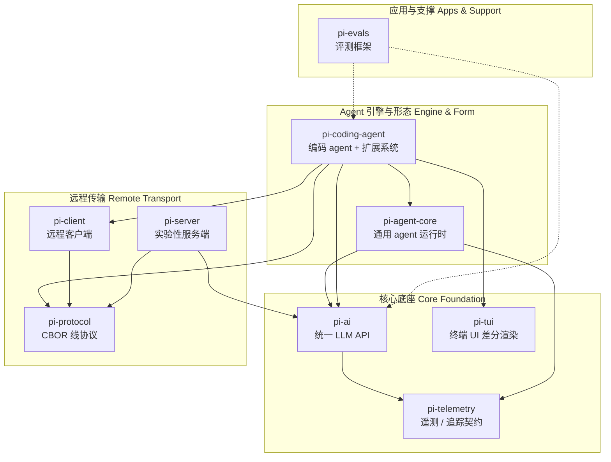

# Pi 基础介绍

Pi 是一个 monorepo（仓库名 `pi-mono`），对外拆成多个 npm 包，而不是一个"全家桶 SDK"。理解它的关键是：**核心能力是领域无关的，远程传输是可插拔的独立层，coding-agent 是把所有层缝合在一起的集成点**。下面按角色分组介绍每个包的能力，再画依赖关系图。

## 包清单与能力

### 核心底座（被几乎所有包依赖）

- **`@earendil-works/pi-telemetry`**（`packages/telemetry`）
  厂商中立的遥测契约 + 类型化 schema 工具。所有埋点 / 可观测性的基础，`pi-ai`、`pi-agent-core` 都依赖它。

- **`@earendil-works/pi-ai`**（`packages/ai`）
  统一 LLM API——自动模型发现、provider 配置、流式补全、以及 `EventStream` 异步事件流。所有"调模型"的底层能力都在这。它内部只依赖 `telemetry`，是地基级包。

- **`@earendil-works/pi-tui`**（`packages/tui`）
  终端 UI 库，差分渲染，面向高效文本应用。coding-agent 的命令行界面建立在它之上。

### 远程传输层（为远端服务，可插拔）

- **`@earendil-works/pi-protocol`**（`packages/protocol`）
  传输中立的 CBOR 线协议，定义远程 session 的字节格式。是 client / server 的契约层，自身零内部依赖。

- **`@earendil-works/pi-client`**（`packages/client`）
  传输中立的远程客户端，通过 framed CBOR 字节与远程 pi session 通信。把"本地 agent"变成"可远程驱动"。只依赖 protocol。

- **`@earendil-works/pi-server`**（`packages/server`）
  实验性服务端包，对外暴露远程 session。依赖 ai + protocol。

### Agent 引擎与形态

- **`@earendil-works/pi-agent-core`**（`packages/agent`，发布名就是 `pi-agent-core`，**不是** `pi-agent`）
  通用 agent 运行时引擎。提供 `Agent` 类、`agentLoop` / `runAgentLoop` 主循环、transport 抽象、状态管理、附件（attachment）支持，以及 harness 层（session、skills、system-prompt、tools 注册表、prompt templates、消息转换）。

  它是领域无关的"发动机"——本身不绑定编码场景，只依赖 `pi-ai` + `pi-telemetry`。**注意它不依赖传输层**，本地优先。

- **`@earendil-works/pi-coding-agent`**（`packages/coding-agent`）
  在引擎之上构建的"编码 agent"这一具体形态。提供 CLI、read / bash / edit / write 工具、session 管理（`createAgentSession` / `AgentSession`）、扩展系统（`ExtensionAPI` / `ExtensionRunner` / loader）、命令系统、模型注册。

  它负责把扩展挂到 core 的 `Agent` 上（`AgentSession` 做 `subscribe` + 事件派发）。这也是你写扩展、起 agent 的主入口。它依赖 agent-core、ai、client、protocol、tui——是**唯一同时缝合所有层的集成点**。

### 应用与支撑

- **`@earendil-works/pi-evals`**（`packages/evals`）
  评测 / 基准框架，构建在 `coding-agent` + `ai` 之上。（注意：其 `package.json` 未 pin 内部依赖，依赖关系是源码层引用，属 workspace 内部。）

- **`session-backends`**（`packages/session-backends/sqlite-node`）
  session 持久化后端（sqlite 存储），是会话存储层的具体实现。**它不是顶层发布包**——本 checkout 里没有顶层 `package.json`，而是以 `sqlite-node` 子包形式挂在会话层下面。

## 依赖关系（mermaid）

按角色分四个 subgraph。箭头表示依赖：`A --> B` 即「A 依赖 B」，图中上层为基础 / 被依赖方，下层为构建于其上的包。`evals` 的虚线边表示它是源码层依赖（`package.json` 未 pin）。

## 对你的稿子有用的几条

1. **Pi 不是单一 SDK，而是按角色分层的包集合。** 核心底座（telemetry / ai / tui）被几乎所有包依赖；远程传输（protocol / client / server）是可选的独立层；agent-core 是领域无关的引擎；coding-agent 是具体形态 + 扩展系统的集成点。
2. **扩展系统和 SDK 入口（`createAgentSession` / `AgentSession`）都在 `pi-coding-agent`；底层 `Agent` / `agentLoop` 在 `pi-agent-core`。** 想碰底层引擎得额外引 `pi-agent-core`。
3. **`agent-core` 不依赖传输层，本地优先**——这点跟 langchain 那种把远程/本地混在一起的单体库是不同的设计取向，对比时可以当标尺。
4. **telemetry / protocol / tui 三个零内部依赖的底座**，说明 Pi 把"可观测性、线协议、UI"都当一等公民抽出来了；而 `evals`、`session-backends` 是构建在核心之上的评测与持久化支撑。
