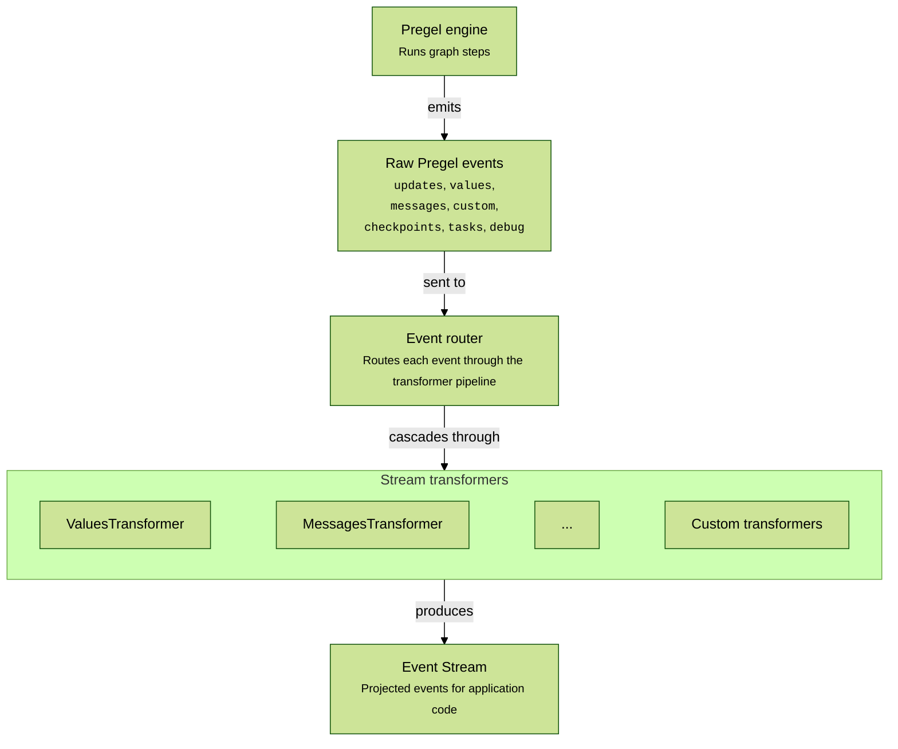

LLM的交互是非常耗时的操作，特别是开启了推理（reasoning）之后，拿到LLM的完整反馈，需要等待的时间可能需要数秒到数十秒，因此stream模式几乎是标准的与LLM交互的模式。LangGraph的工作流也提供了工作流的stream模式，支持如下类型的stream；

### Stream

LangGraph提供的Stream支持同步和异步模式，分别调用`graph.stream({}, stream_mode=[])`或者`graph.astream({},stream_mode=[])`来获得流式输出，支持的stream模式如下，

| 模式 | 类型 | 说明 |
| ------------------------------------------------------------------------------------ | ----------------------------------------------------------------------------------------------------- | ------------------------------------------------------------------------------------------------------------------------------------ |
| [values](https://docs.langchain.com/oss/python/langgraph/streaming#graph-state)      | [`ValuesStreamPart`](https://reference.langchain.com/python/langgraph/types/ValuesStreamPart)         | 每个步骤执行后的完整状态快照                                                                                                          |
| [updates](https://docs.langchain.com/oss/python/langgraph/streaming#graph-state)     | [`UpdatesStreamPart`](https://reference.langchain.com/python/langgraph/types/UpdatesStreamPart)       | 每个步骤的状态更新。同一步骤内多个节点的更新会分别推送                                            |
| [messages](https://docs.langchain.com/oss/python/langgraph/streaming#llm-tokens)     | [`MessagesStreamPart`](https://reference.langchain.com/python/langgraph/types/MessagesStreamPart)     | LLM 调用产生的 (token, metadata) 二元组                                                                                    |
| [custom](https://docs.langchain.com/oss/python/langgraph/streaming#custom-data)      | [`CustomStreamPart`](https://reference.langchain.com/python/langgraph/types/CustomStreamPart)         | 通过 get_stream_writer 从节点发出的自定义数据 |
| [checkpoints](https://docs.langchain.com/oss/python/langgraph/streaming#checkpoints) | [`CheckpointStreamPart`](https://reference.langchain.com/python/langgraph/types/CheckpointStreamPart) | Checkpoint 事件（格式同 get_state()），需要配置 checkpointer |
| [tasks](https://docs.langchain.com/oss/python/langgraph/streaming#tasks)             | [`TasksStreamPart`](https://reference.langchain.com/python/langgraph/types/TasksStreamPart)           | 任务的启动和完成事件，含结果和错误信息，需要配置 checkpointer                                                           |
| [debug](https://docs.langchain.com/oss/python/langgraph/streaming#debug)             | [`DebugStreamPart`](https://reference.langchain.com/python/langgraph/types/DebugStreamPart)           | 尽可能多的信息——整合了 checkpoints 和 tasks 并附带额外元数据                                                         |
通过stream_mode来获取workflow的执行输出时，用得比较多的是
- values，返回每个步骤执行后完整快照；
- updates，只返回每个步骤更新的快照；

如下是官方提供的一个简单示例，`State`里是包含`topic`和`joke`两个属性，
- `refine_topic` 进行了topic优化，返回只更新了topic
- `generate_joke` 基于topic生成joke，返回只更新了joke
```python
from typing import TypedDict
from langgraph.graph import StateGraph, START, END


class State(TypedDict):
  topic: str
  joke: str


def refine_topic(state: State):
    return {"topic": state["topic"] + " and cats"}


def generate_joke(state: State):
    return {"joke": f"This is a joke about {state['topic']}"}

graph = (
  StateGraph(State)
  .add_node(refine_topic)
  .add_node(generate_joke)
  .add_edge(START, "refine_topic")
  .add_edge("refine_topic", "generate_joke")
  .add_edge("generate_joke", END)
  .compile()
)
```

如果通过updates来获得workflow的执行输出，那么会得到每个SuperStep更新的值，
```python
for chunk in graph.stream(
    {"topic": "ice cream"},
    stream_mode="updates",
    version="v2",
):
    if chunk["type"] == "updates":
        for node_name, state in chunk["data"].items():
            print(f"Node `{node_name}` updated: {state}")
```
监听updates的输出如下，
```shell
Node `refine_topic` updated: {'topic': 'ice cream and cats'}
Node `generate_joke` updated: {'joke': 'This is a joke about ice cream and cats'}
```

如果通过values来获得workflow的执行输出，那么会得到每个SuperStep执行完成后，`State`的完整的值
```python
for chunk in graph.stream(
    {"topic": "ice cream"},
    stream_mode="values",
    version="v2",
):
    if chunk["type"] == "values":
        print(f"topic: {chunk['data']['topic']}, joke: {chunk['data']['joke']}")
```
监听 values得到的output如下，
```shell
topic: ice cream, joke:
topic: ice cream and cats, joke:
topic: ice cream and cats, joke: This is a joke about ice cream and cats
```

- messages，返回的是与LLM交互的信息；使用messages来获得与LLM交互的信息，需要使用langchain提供的LLM交互机制，如果不希望使用langchain封装的LLM交互方法，则需要自行实现 custom stream；

自定义 custom，需要通过langgraph提供的 `stream_writer` 自行将你使用的LLM client的stream chunk 写入，`writer({"custom_llm_chunk": chunk})`，
```python
from langgraph.config import get_stream_writer

def call_arbitrary_model(state):
    """Example node that calls an arbitrary model and streams the output"""
    # Get the stream writer to send custom data
    writer = get_stream_writer()
    # Assume you have a streaming client that yields chunks
    # Generate LLM tokens using your custom streaming client
    for chunk in your_custom_streaming_client(state["topic"]):
        # Use the writer to send custom data to the stream
        writer({"custom_llm_chunk": chunk})
    return {"result": "completed"}
```

在stream_mode中，监听custom通道返回的数据，即可得到你自定义的流式输出信息；
```python
graph = (
    StateGraph(State)
    .add_node(call_arbitrary_model)
    # Add other nodes and edges as needed
    .compile()
)
# Set stream_mode="custom" to receive the custom data in the stream
for chunk in graph.stream(
    {"topic": "cats"},
    stream_mode="custom",
    version="v2",
):
    if chunk["type"] == "custom":
        # The chunk data will contain the custom data streamed from the llm
        print(chunk["data"])
```

### Event Stream

Event Stream 是官方推荐的进程内流式模型，适用于大部分 LangGraph 应用代码。它返回一个 run stream 对象，可以同时从多个角度消费流式数据。

新版本的 LangGraph，更推荐使用 EventStream 来获得工作流执行的流式输出。其实 Stream 和 EventStream 底层都从 Pregel 引擎拿原始事件（updates、values、messages 等），区别在于怎么给你：

- **Stream** 是按你指定的 `stream_mode` 过滤后直接吐数据结构——比如 `stream_mode="values"` 你就拿到 `(node_name, state_dict)` 的 tuple，需要你自己按 `chunk["type"]` 分支处理。
- **EventStream** 多了一组 stream transformer（看上图），把原始事件路由到不同的 transformer，产出类型化的投影对象。你用 `stream.messages` 就直接拿到 MessageStream 对象，用 `stream.values` 拿到状态快照，不用自己写 if-else 分支。

要注意的是，EventStream 的投影和 Stream 的 mode 不是一一对应的——比如 Stream 的 `updates`、`checkpoints`、`tasks`、`debug` 这几个 mode，EventStream 没有等价的投影。两套 API 各有所长，不是谁是谁的超集。

|投影|用途|
|---|---|
|`stream`|遍历全部协议事件|
|`stream.messages`|流式输出聊天模型的消息和 token 增量|
|`stream.values`|遍历状态快照并等待最终值|
|`stream.output`|等待最终输出|
|`stream.subgraphs`|发现并观察嵌套的子图执行|
|`stream.interrupts`|查看人机交互（HITL）的中断信息|
|`stream.interrupted`|检测 run 是否因等待人工输入而暂停|

如下是event stream的处理架构，Pregel engine发出原生的事件，原始的event会发送到 event router，event router将不同类型的事件提交到对应的 transformer，再生产出结构化的 event stream；




通过event stream获得workflow的流式输出，需要指定v3版本，
```python
stream = workflow.event_stream({},version="v3")

#结构化的访问stream的信息
for message in stream.messages:
    text = str(message.text)
    usage = message.output.usage_metadata

    print(text)
    print(usage)

```

对比使用stream，需要自行指定`stream_mode`,以及自行处理访问的数据
```python
async for chunk in graph.astream(
    {"topic": "cats"},
    stream_mode="messages",
    version="v2",
):
    if chunk["type"] == "messages":
        msg, metadata = chunk["data"]        
```

langchain给出的使用 event_stream的优势 : 

除了单个事件的对象化结构，Event Stream 相比传统 Stream 模式还有几个架构层面的优势：

- **类型安全的投影**：它提供了一套类型化的投影 API，不同事件类型对应不同的迭代器。你不用根据 `stream_mode` 手动写 if-else 来分支处理不同数据形状。
- **逻辑更简洁**：不用操心复杂 tuple 或条件判断，Event Stream 给的是统一的 StreamPart 字典结构，消费端的代码更干净、更好维护。
- **关注点分离更精细**：每种投影有独立的迭代器，你可以把 LLM token 推前端、状态更新记日志、自定义事件追踪进度，这几件事各走各的通道，不用揉在一个循环里。
- **更好的类型推导**：使用 `version="v3"` 后，IDE 能正确推导 `chunk["type"]` 对应的 `chunk["data"]` 结构，大幅减少因数据结构不匹配导致的运行时错误。


看起来使用event_stream 获得workflow的流式输出，要方便一些，但是这个是不是另外一个过渡封装，现在还不好说；
使用哪一种，主要看你的使用场景；
>BTW，event_stream的API现在还是beta阶段


----


Workflow有一个特别的属性，`channels`，包含的信息如下，你知道用途是啥不，下次咱们聊聊`channels`

```shell
{'__pregel_tasks': <langgraph.channels.topic.Topic object at 0x10714bd40>,
 '__start__': <langgraph.channels.ephemeral_value.EphemeralValue object at 0x107142e80>,
 'branch:to:genJoke': <langgraph.channels.ephemeral_value.EphemeralValue object at 0x10714b780>,
 'branch:to:humanReview': <langgraph.channels.ephemeral_value.EphemeralValue object at 0x107149ec0>,
 'branch:to:review': <langgraph.channels.ephemeral_value.EphemeralValue object at 0x106bf0480>,
 'branch:to:translate': <langgraph.channels.ephemeral_value.EphemeralValue object at 0x107149bc0>,
 'content': <langgraph.channels.last_value.LastValue object at 0x107142c00>,
 'humanReviewResult': <langgraph.channels.last_value.LastValue object at 0x107141700>,
 'retryCount': <langgraph.channels.last_value.LastValue object at 0x107142bc0>,
 'reviewResult': <langgraph.channels.last_value.LastValue object at 0x107142380>,
 'topic': <langgraph.channels.last_value.LastValue object at 0x107141400>}
```
