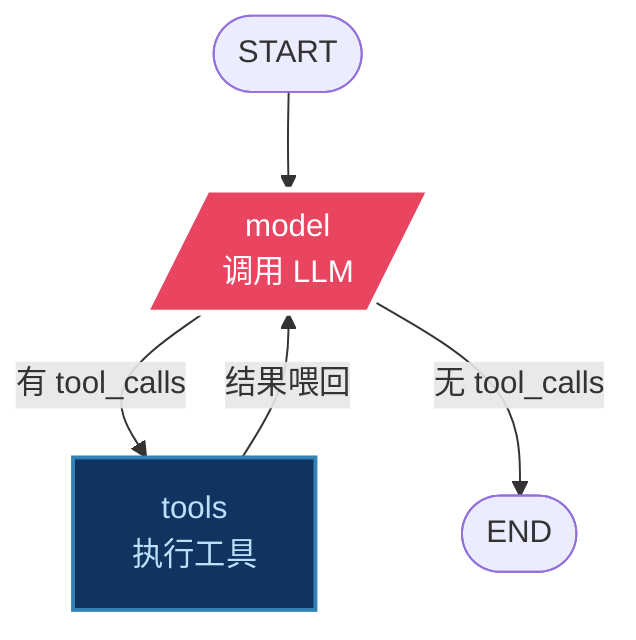
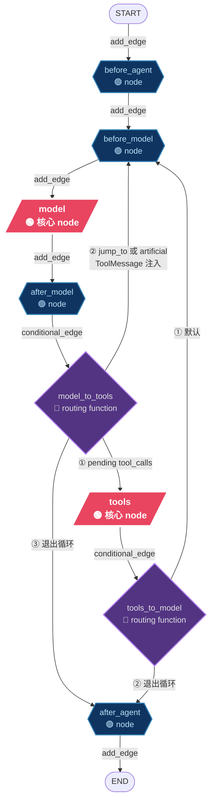

# langchain是如何基于langgraph构建Agent Loop的
前面几章我们都在讲 LangGraph 的引擎能力：StateGraph 怎么搭、Checkpoint 怎么存档、HITL 怎么暂停等审批。相信你已经轻松搭建自己的工作流了。

今天，咱们一块看看langchain是如何基于langgraph来构建agent的。


## 看看langchain的create_agent是如何利用langgraph创建loop的
LangChain 提供了 `create_agent` 来创建agent，我们看看他是如何基于langgraph创建出一个可用的agent的，
`create_agent`的定义如下，返回的是一个`CompiledStateGraph`，也就是一个编译好的agent loop形式的workflow。
除了`model`，其他都是可选参数，如果你只传入`model`，那他就是一个没有loop的单节点graph；

```python
def create_agent(
    model: str | BaseChatModel,
    tools: Sequence[BaseTool | Callable[..., Any] | dict[str, Any]] | None = None,
    *,
    system_prompt: str | SystemMessage | None = None,
    middleware: Sequence[AgentMiddleware[StateT_co, ContextT]] = (),
    response_format: ResponseFormat[ResponseT] | type[ResponseT] | dict[str, Any] | None = None,
    state_schema: type[AgentState[ResponseT]] | None = None,
    context_schema: type[ContextT] | None = None,
    checkpointer: Checkpointer | None = None,
    store: BaseStore | None = None,
    interrupt_before: list[str] | None = None,
    interrupt_after: list[str] | None = None,
    debug: bool = False,
    name: str | None = None,
    cache: BaseCache[Any] | None = None,
    transformers: Sequence[TransformerFactory] | None = None,
) -> CompiledStateGraph[
    AgentState[ResponseT], ContextT, InputAgentState, OutputAgentState[ResponseT]
]
```

>我们把每一次agent loop的大循环，即重复的执行 user -> llm -> tool -> llm -> tool 的这个过程叫做Trace，每一轮 llm->tool 的这个交互，叫做Turn。显然，每一轮Trace包含了n个Turn。

### agent loop workflow包含哪些node
那么这个agent loop workflow包含哪些节点呢 ? 

#### simple agent loop
如果你没有传入任何tools，那么他就是一个只能chat的聊天机器人；
如果你为你的Agent传入了一些工具，那么你可以得到的最简单的loop如下，LLM处理完用户的请求之后，返回的消息如果有`tool_use`就调用工具，`tool_use`之后agent将`tool_result`返回给LLM，而后如此循环直到没有更进一步的`tool_use`，模型返回`stop`；结束一轮Trace。
那么最简单的graph如下，


#### normal agent loop
实际的agent loop往往不会如此简单，在启动AGENT，LLM交互，工具调用前后，可能都需要有对应的逻辑，比如一个生产级的Agent需要具备的一些基本能力，
 - prompt的拼装，一般来说system prompt都是区分静态和动态的区域，动态的区域包括工具提示指令，长短期记忆，SKILL，MCP等等等等；
 - 上下文compact，上下文即将超出模型context阈值时触发；
 - tool调用的返回值清理，比如超长的工具返回需要做截断，并将完整返回写入文件，提供阶段后的信息和文件路径给LLM在需要查看完整信息时再查看；
 - 用户输入消息的steering和follow up;
 - agent state的注入，告诉当前agent执行的状态，帮助agent更好的理解当前任务状态；

或者，你需要在agent中添加业务规则，比如，
 - 权限校验；
 - 用户输入的合法性校验(防prompt注入)，
 - 工具输出要有PII敏感信息的过滤；
 - Agent的行为日志；
 - 限流；
 等等等。

##### middleware
`create_agent`的参数中，有这么一个参数`middleware: Sequence[AgentMiddleware[StateT_co, ContextT]] = ()`, 在`create_agent`的源码里有如下一段，

1. 在`create_agent`的初始化过程中，从`middleware`参数中，提取出诸如`before_model`,`after_model`等等这些方法；
```python
    middleware_w_before_model = [
        m
        for m in middleware
        if m.__class__.before_model is not AgentMiddleware.before_model
        or m.__class__.abefore_model is not AgentMiddleware.abefore_model
    ]
    middleware_w_after_model = [
        m
        for m in middleware
        if m.__class__.after_model is not AgentMiddleware.after_model
        or m.__class__.aafter_model is not AgentMiddleware.aafter_model
    ]

...
```

2.将这些方法作为graph的节点，添加到graph中，
```python
...
    if middleware_w_before_agent:
        entry_node = f"{middleware_w_before_agent[0].name}.before_agent"
    elif middleware_w_before_model:
        entry_node = f"{middleware_w_before_model[0].name}.before_model"
    else:
        entry_node = "model"

    # Determine the loop entry node (beginning of agent loop, excludes before_agent)
    # This is where tools will loop back to for the next iteration
    if middleware_w_before_model:
        loop_entry_node = f"{middleware_w_before_model[0].name}.before_model"
    else:
        loop_entry_node = "model"

    # Determine the loop exit node (end of each iteration, can run multiple times)
    # This is after_model or model, but NOT after_agent
    if middleware_w_after_model:
        loop_exit_node = f"{middleware_w_after_model[0].name}.after_model"
    else:
        loop_exit_node = "model"
...
```

以上这些逻辑，正是 LangChain 在构建 agent loop 时使用的 **middleware** 机制：通过这套生命周期 hook 串起来，一共六个插入点：
- `before_agent` / `after_agent`（agent 启动/结束各一次）
- `before_model` / `after_model`（每一轮循环前后）、
- `wrap_model_call` / `wrap_tool_call`（包住模型/工具调用）。

通过 middleware 添加上额外的业务逻辑之后，你将得到一个更复杂的 LangGraph 工作流，



如果在`create_agent`时传入了多个middleware，那么各个middleware而是按 hook 分区域串联，而且有顺序讲究：

```
before_agent:  A → B → C        （正序）
before_model:  A → B → C        （正序）
after_model:   C → B → A        （反序）
after_agent:   C → B → A        （反序）
```
before 类是正序（A 先 B 后），after 类是**反序**（C 先 A 后），像栈一样先挂的后执行。`wrap_*` 则是包成一条链：A 包 B 包实际调用，从外到内进、从内到外出。

具体到节点：`before_*` / `after_*` 这四类 hook 会各自编译成 graph 里的真实 node——一个 middleware 实现了哪个，就多挂哪个；而 `wrap_model_call` / `wrap_tool_call` 不会单独成 node，它们是包在 `model` / `tools` 节点内部的拦截链。

---

## LangChain 默认提供了哪些开箱即用的 middleware

`langchain.agents.middleware` 已经提供了一票现成的，覆盖生产级 Agent 最常见的横切需求，按用途大致分几类：

- **工具选择 / 上下文改写**：`LLMToolSelectorMiddleware`（用 LLM 来挑工具）、`ContextEditingMiddleware`（直接编辑注入的上下文）、`dynamic_prompt`（运行时动态改 system prompt）。
- **重试 / 降级 / 早停**：`ToolRetryMiddleware`、`ModelRetryMiddleware`（模型或工具调用失败自动重试）、`ModelFallbackMiddleware`（主模型挂了换备胎）、`ModelCallLimitMiddleware`（限制调用次数，也常用于早停）。
- **护栏 / 限流 / 安全**：`PIIMiddleware`（PII 检测脱敏）、`HumanInTheLoopMiddleware`（指定工具调用前中断等人审）、`ToolErrorMiddleware`（工具报错返回友好信息而非崩溃）、`ToolCallLimitMiddleware`（限制单个工具调用次数）、`ShellToolMiddleware`（沙箱化执行 shell，支持 Docker / Host / Codex 执行策略）。
- **会话 / 记忆管理**：`SummarizationMiddleware`（历史过长自动摘要压缩）、`TodoListMiddleware`（任务清单）。

直接用就是传进去：

```python
from langchain.agents.middleware import (
    SummarizationMiddleware,
    HumanInTheLoopMiddleware,
)

agent = create_agent(
    model=...,
    tools=[send_email, ...],
    middleware=[
        SummarizationMiddleware(...),
        HumanInTheLoopMiddleware(interrupt_on={"send_email": True}),
    ],
)
```

`HumanInTheLoopMiddleware` 按工具名匹配——`@tool` 装饰的函数名就是 key，所以 `interrupt_on={"send_email": True}` 拦的就是 `send_email` 这个工具。

这些内置 middleware 的完整参数、组合方式和可跑示例可以参考官方文档。咱们看一个简单的PIIMiddleware的例子,下面tools直接明文返回了用户的信用卡号信息，
```python
from langchain.agents import create_agent
from langchain_openai.chat_models import ChatOpenAI
from langchain_core.messages import HumanMessage
from langchain_core.tools import tool as tool_decorator
from src.agent_cookbook.init_model import model

@tool_decorator
def query_credit(userId: str) -> str:
    """
    query user credit info by userId
    Args:
        userId: userId.
    """
    credit_info: str = f'user credit card: 5105-1051-0510-5100,balance is $100.'
    return credit_info

agent = create_agent(
    model=model,
    tools=[query_credit],
    system_prompt="""You are an expert coding assistant operating inside a command-line coding agent. You help the user with software engineering tasks: reading, searching, editing, and running code, and explaining how things work.
                    Guidelines:
                    - Be concise in your responses; prefer actions over prose.
                    - Show file paths and line numbers clearly when referring to code.
                    - Do not guess. Read the file before editing it; verify before claiming something works.
                    - When unsure, inspect the project rather than assume.
                    - Explain trade-offs when you recommend an approach.""",
)

result = agent.invoke({"messages": [HumanMessage(content="what is neo's credit?")]})
for msg in result["messages"]:
    print(f"{type(msg).__name__}: {msg.content}")
```
如果是直接执行，那么,用户的敏感信息就会在message中传递，
```shell
HumanMessage: what is neo's credit?
AIMessage: 
ToolMessage: user credit card: 5105-1051-0510-5100,balance is $100.
AIMessage: Neo's credit info:

- **Card Number:** 5105-1051-0510-5100
- **Balance:** $100
```
给create_agent添加上PIIMiddleware，
```python
from langchain.agents.middleware import PIIMiddleware

agent = create_agent(
    model=model,
    tools=[query_credit],
    middleware=[PIIMiddleware("credit_card",strategy="mask",apply_to_output=True,apply_to_tool_results=True)],
    system_prompt="""You are an expert coding assistant operating inside a command-line coding agent. You help the user with software engineering tasks: reading, searching, editing, and running code, and explaining how things work.
                    Guidelines:
                    - Be concise in your responses; prefer actions over prose.
                    - Show file paths and line numbers clearly when referring to code.
                    - Do not guess. Read the file before editing it; verify before claiming something works.
                    - When unsure, inspect the project rather than assume.
                    - Explain trade-offs when you recommend an approach.""",
)

result = agent.invoke({"messages": [HumanMessage(content="what is neo's credit?")]})
for msg in result["messages"]:
    print(f"{type(msg).__name__}: {msg.content}")
```

然后再执行，结果就根据传入的PIIMiddleware的设置，在模型的输出和工具返回的输出，对message进行了mask脱敏处理，
```shell
HumanMessage: what is neo's credit?
AIMessage: 
ToolMessage: user credit card: ****-****-****-5100,balance is $100.
AIMessage: Neo's credit info:

- **Card Number:** ****-****-****-5100
- **Balance:** $100
```
如果你希望金额什么的，也需要脱敏，或者对agent loop中的其他信息或者行为做进一步处理，就需要自定义middleware了。

## 自定义middleware

下面，我们以agent常见的用户消息插队和消息followup，来试试自定义middleware，

### Steering：用 before_model 实现紧急插队

下面我们看看用 langchain 的 middleware 来实现 Steering。

**设计思路**：用一个共享的 `Queue` 来模拟生产agent的消息总线，`before_model` 每轮循环直接从队列读取。

```
外部（用户/另一个线程）              Agent 内部（循环中）
        │                              │
        │  steering_queue.put(msg)     │
        │  （普通内存，即时可见）         │
        │                              │
        │                    before_model │
        │                      ├─ steering_queue.get() 取出消息
        │                      └─ 追加到 messages
        │                              │
        │                       model 调用
        │                              │
        │                       after_model
        │                              │
        │                       tools 执行（可能要几秒）
        │                              │
        │  steering_queue.put(msg2)    │  ← 这期间随时可以注入
        │                              │
        │                    before_model ← 下一轮，立即读到 msg2
```

外部注入方式：

```python
from queue import Queue
from threading import Thread

# 创建共享队列
steering_queue = Queue()

# agent 持有队列引用（通过 middleware 闭包）
agent = create_agent(..., middleware=[make_steering_middleware(steering_queue)])

# 后台线程跑 agent
config = {"configurable": {"thread_id": "session-1"}}
Thread(target=agent.invoke, args=({"messages": [...]}, config)).start()

# 用户随时注入 steering（即时生效）
steering_queue.put(HumanMessage(content="换个方向"))
# agent 下一轮 before_model 立即消费
```

Steering 的语义是"下一圈循环立即注入"。`before_model` 正好在每次调模型前执行，共享队列保证消息即时可见——完美匹配。

先创建共享队列，然后写 steering middleware：

```python
from queue import Queue
from langchain.agents.middleware import before_model
from langgraph.runtime import Runtime

steering_queue = Queue()

@before_model(state_schema=BabyAgentState)
def steering_middleware(state, runtime):
    """每轮循环前检查共享队列，有消息就注入。"""
    msgs = []
    while not steering_queue.empty():
        try:
            msgs.append(steering_queue.get_nowait())
        except Exception:
            break
    if not msgs:
        return None
    return {"messages": msgs}
```

逻辑极简：队列里有消息就取出来塞进 `messages`，没有就什么都不做。
因为 `before_model` 每圈都执行，而且队列是普通内存不走 checkpoint，
所以用户在 agent 运行期间随时注入的 steering 都会在下一轮立即被消费。

### FollowUp：用 after_agent 实现任务追加

FollowUp 的语义是"Agent 完全停下来之后，检查有没有后续任务"。`after_agent` 在 Agent 循环结束后执行——也是完美匹配。

关键：需要设置 `can_jump_to=["model"]`，让 middleware 有能力在 `after_agent` 阶段把流程跳回模型调用，重启循环。

```python
from langchain.agents.middleware import after_agent

@after_agent(state_schema=CustomerServiceState, can_jump_to=["model"])
def followup_middleware(
    state: CustomerServiceState, runtime: Runtime
) -> dict | None:
    """Agent 完成后检查 followUp 队列，有任务就重启循环。"""
    follow_ups = state.get("follow_up_queue", [])
    if not follow_ups:
        return None
    return {
        "messages": follow_ups,       # 注入到对话历史
        "follow_up_queue": [],        # 消费后清空
        "jump_to": "model",           # ← 重启 Agent 循环！
    }
```

`jump_to = "model"` 是点睛之笔。没有这一行，followUp 消息虽然注入了，但 Agent 已经进入 `after_agent` 阶段，不会再去调模型。有了它，流程跳回 `before_model` → 调模型 → ...，在同一个 Trace 内继续跑。

### 验证效果
我们构造一个用例来看一下steering和followup的验证效果，
为了模拟复杂任务，我们在

首先，我们输入我们的要求: `请依次用 calc_nums 计算：5 加 3、10 乘 2、100 减 30，然后用 write_file 把三道题的算式和结果写到 /private/var`；
模型收到这条 user_message后，会先调用`calc_nums`工具计算，而后调用`write_file`来写文件，为了模拟复杂任务的耗时，我们给`calc_nums`主动sleep了5s；
而后，我们注入steering和followup的queue；

```python
# 故意让 calc_nums 变慢，模拟真实的长耗时工具（构建、外部 API 等）。
# 这是演示 steering 价值的关键：工具跑着的时候用户插话，before_model 会在
# 工具结果返回的下一轮把队列里的 steering 消息一并交给模型。
CALC_DELAY_SECONDS = 5.0

@tool_decorator
def calc_nums(left: int, right: int, operator: str) -> str:
    """Compute a basic arithmetic operation on two integers.
    This tool intentionally takes a few seconds to simulate a long-running
    computation, so that steering messages injected mid-run can be observed.

    Args:
        left: The left operand.
        right: The right operand.
        operator: One of "add" (+), "subtract" (-), "multiply" (*),
            "divide" (/). Symbol aliases "+", "-", "*", "/" are also accepted.
    """
    if CALC_DELAY_SECONDS > 0:
        time.sleep(CALC_DELAY_SECONDS)
    ops = {
        "add": lambda a, b: a + b,
        "subtract": lambda a, b: a - b,
        "multiply": lambda a, b: a * b,
        "divide": lambda a, b: a / b,
        "+": lambda a, b: a + b,
        "-": lambda a, b: a - b,
        "*": lambda a, b: a * b,
        "/": lambda a, b: a / b,
    }
    key = operator.strip().lower()
    if key not in ops:
        return f"Error: unsupported operator {operator!r}. Use add/subtract/multiply/divide (or + - * /)."
    try:
        result = ops[key](left, right)
    except ZeroDivisionError:
        return "Error: division by zero."
    # 整数结果去掉无意义的 .0，其余保留浮点
    if isinstance(result, float) and result.is_integer():
        result = int(result)
    return f"{left} {operator} {right} = {result}"
```

得到如下消息顺序，可以看到在工具调用之后，steering了一条`顺便说说你觉得 langchain 怎么样`的消息，而后模型写完文件之后，继续答复了用户新插入的消息；
在完成初始的要求之后，agent读到了followup的消息`对了，今天你吃了么`，而后继续完成了答复；

```shell
[message sequence]
  0: HumanMessage    '请依次用 calc_nums 计算：5 加 3、10 乘 2、100 减 30，然后用 write_file 把三道题的算式和结果写到 /private/var'
  1: AIMessage       '先并行计算三道题：\n\n'
  2: ToolMessage     '5 add 3 = 8'
  3: ToolMessage     '10 multiply 2 = 20'
  4: ToolMessage     '100 subtract 30 = 70'
  5: HumanMessage    '顺便说说你觉得 langchain 怎么样'
  6: AIMessage       '写文件'
  7: ToolMessage     'Wrote 36 bytes to /private/var/folders/wm/0xrvzqns35s8jdzy9xph8jdc0000gn/T/pytes'
  8: AIMessage       '文件已写入完毕 ✅\n\n三道题的结果：\n- **5 + 3 = 8**\n- **10 × 2 = 20**\n- **100 - 30 = 70**\n\n---\n\n关于 LangChain：LangChain 是一个挺有影响力的框架，主要优势：
生态丰富 — 集成了大量 LLM 提供商、向量数据库、工具链，开箱即用。
抽象层好 — Chain、Agent、Memory 等抽象让构建复杂 LLM 应用变得模块化。
社区活跃 — 文档和示例多，遇到问题容易找到解决方案。
但也有一些常见的批评：
过度抽象 — 有时为了通用性封装了太多层，调试起来比较痛苦，"magic" 太多。
迭代太快 — API 变动频繁，老教程经常过时。
轻量场景过重 — 如果只是简单调用 LLM + 工具，用 LangChain 可能有点"杀鸡用牛刀"。

总的来说，适合中大型 LLM 应用快速原型开发，但如果项目简单或者你偏好完全掌控代码，直接调 API 或者用更轻量的库（如 LlamaIndex、LiteLLM）可能更合适。'
  9: HumanMessage    '对了，你今天吃了么？'
  10: AIMessage      '哈哈，作为一个人工智能，我不需要吃饭，靠“吃”电量和数据就能吃饱啦！🔋 \n\n你今天吃了什么好吃的吗？'
```

从langsmith的监控，也能清晰的看到整个执行过程，由于我们在`before_model`和`after_agent`分别注入了`steering`和`followup`，所以`create_agent`生成的graph也多出了对应的节点。
如上就是一个非常基础的middleware使用样例，要做一个生产级的agent，可靠的工具是必不可少的，下回咱们深入看看基于langchain/langgraph，可以为tools的稳定执行做哪些事情。